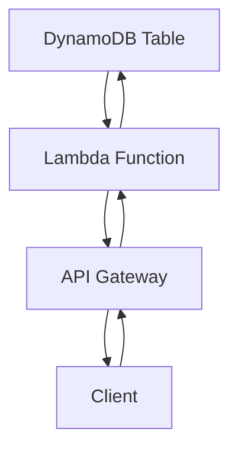

# 実装演習 TODO APIの作成 (Lambda)


## 課題

### 要件

1. CRUD操作をサポートするREST API
1. DynamoDBでデータを永続化
1. API GatewayでHTTPエンドポイントを提供

### 実装手順
1. DynamoDBテーブルの作成
1. Lambda関数の実装（Create, Read, Update, Delete）
1. API Gatewayの設定
1. IAMロールの設定
1. テストとデプロイ

## 構成図

ClientはAPI Gatewayを通じてLambda関数にリクエストを送信し、Lambda関数はDynamoDBテーブルとやり取りをした結果を返却します。



## 実装例

### インフラ実装

今回はCDKではなく、AWS Management Consoleから手動で設定します。

- DynamoDBテーブルの作成: AWS Management Consoleから作成
    - パーティションキー: `id` (String)
    - ほかはデフォルト設定

- Lambda関数の作成: AWS Management Consoleから作成
    - ランタイム: Node.js 22
    - ハンドラー: `lambda_function.lambda_handler`

- API Gatewayの設定: AWS Management Consoleから作成
    - Lambda関数を紐づける


IAMからアクセスキーを作成し AWS CLIを認証するとCLIからも操作可能です。


### 動作確認の方法
1. Lambda関数のURLを発行して直接リクエストを送る
2. Lambda関数に紐づけたAPI Gatewayを通じてリクエストを送る
3. GET関数はブラウザでアクセスして確認可能
4. POST, PUT, DELETEはcurlなどでリクエストを送る
   ```bash
   # GET
   curl https://ENDPOINT/todos -H "Content-Type: application/json"
   # POST
   curl -X POST https://ENDPOINT/todos -H "Content-Type: application/json" -d '{"title": "New Task", "dueDate": "2024-12-31"}'
   # PUT
   curl -X PUT https://ENDPOINT/todos/{id} -H "Content-Type: application/json" -d '{"completed": true}'
   # DELETE
   curl -X DELETE https://ENDPOINT/todos/{id}
   ```

### Lambda関数の実装

#### ファイル構成

```tree
.
├── index.mjs
└── package.json
```

#### package.json

```json
{
  "name": "lambda-crud-api",
  "version": "1.0.0",
  "description": "A simple CRUD API using AWS Lambda and DynamoDB",
  "main": "index.mjs", // <- エントリポイントを指定 (今回はファイルが.mjsなので.mjsにする)
  "type": "module",
  "scripts": {
    "start": "node index.mjs" // <- ローカルで動作確認する場合に使用
  },
  "dependencies": {
    "@aws-sdk/client-dynamodb": "^3.0.0", // <- AWS SDK v3のDynamoDBクライアント
    "@aws-sdk/lib-dynamodb": "^3.0.0" // <- DynamoDB Document Client
  }
}
```

通常このファイルは次のようにして作成します。

```bash
npm init -y
npm install @aws-sdk/client-dynamodb @aws-sdk/lib-dynamodb
```

#### index.mjs の実装1
まずは最小実装で API Gateway + Lambda が動作することを確認します。

```javascript
export const handler = async (event) => {
  console.log("Event:", JSON.stringify(event, null, 2));
  return {
    statusCode: 200,
    body: JSON.stringify({ message: "Hello from Lambda!" }),
  };
};
```

この状態でAPI Gatewayからリクエストを送ると、Lambda関数が呼び出されてレスポンスが返ってくることを確認してください。

Checkポイント:
- Lambda関数のURLを発行して直接リクエストを送る
- Lambda関数に紐づけたAPI Gatewayを通じてリクエストを送る

#### index.mjs の実装2
次に、DynamoDBをつなぎます。
適当なデータを登録してみて、DynamoDBにデータが保存されることを確認します。

```javascript
// DynamoDBを操作するための諸々
import { DynamoDBClient } from "@aws-sdk/client-dynamodb";
import { DynamoDBDocumentClient } from "@aws-sdk/lib-dynamodb";
const ddb = DynamoDBDocumentClient.from(new DynamoDBClient({}));

// Lambda関数のエントリポイント
export const handler = async (event) => {

  ddb.send({
    TableName: "YourTableName", // <- ここは作成したDynamoDBテーブル名に置き換える
    Item: {
      id: crypto.randomUUID(), // <- 適当なIDを生成
      message: "Hello, DynamoDB!",
      createdAt: new Date().toISOString(),
    },
  });

  console.log("Event:", JSON.stringify(event, null, 2));
  return {
    statusCode: 200,
    body: JSON.stringify({ message: "Hello from Lambda!" }),
  };
};
```

これでアクセスのたびにDynamoDBにデータが保存されるようになります。
DynamoDBのコンソールからデータが保存されていることを確認してください。

#### index.mjs の実装3

```javascript
// DynamoDBを操作するための諸々
import { DynamoDBClient } from "@aws-sdk/client-dynamodb";
import {
  DynamoDBDocumentClient,
  PutCommand,
  GetCommand,
  ScanCommand,
  UpdateCommand,
  DeleteCommand,
} from "@aws-sdk/lib-dynamodb";

const ddb = DynamoDBDocumentClient.from(new DynamoDBClient({}));

// Lambda関数の環境変数から呼び出す (環境分離した場合などに便利)
// もちろんハードコードしても良い
const TABLE = process.env.TABLE_NAME;

// JSONレスポンスを返すためのユーティリティ
const json = (statusCode, body = {}) => ({
  statusCode,
  headers: {
    "content-type": "application/json",
    "access-control-allow-origin": "*",
    "access-control-allow-headers": "Content-Type",
    "access-control-allow-methods": "GET,POST,PUT,DELETE,OPTIONS",
  },
  body: JSON.stringify(body),
});

// リクエストボディをパースするユーティリティ
const parseBody = (event) => {
  try {
    return event.body ? JSON.parse(event.body) : {};
  } catch {
    return null;
  }
};

// 正規表現を先に定義しておく
const isTodosRoot = (path) => /^\/todos\/?$/.test(path);
const isTodosById = (path) => /^\/todos\/([^/]+)\/?$/.test(path);
const idFromPath = (path) => path.split("/").filter(Boolean).pop();

// Lambda関数のエントリポイント
export const handler = async (event) => {
  const method = event?.requestContext?.http?.method || event.httpMethod;
  const path = event?.requestContext?.http?.path || event.rawPath || event.path;

  // OPTIONSはCORS対応のために常に200を返す
  // API Gatewayでも設定できるが、ここでも明示しておく
  if (method === "OPTIONS") {
    return json(200, { ok: true });
  }

  try {
    // 新規作成
    if (method === "POST" && isTodosRoot(path)) {
      // bodyのパースとバリデーション
      const body = parseBody(event);
      if (!body) return json(400, { message: "invalid JSON" });
      const { title, dueDate = null } = body;
      if (!title || typeof title !== "string") return json(400, { message: "title is required" });

      const id = crypto.randomUUID(); // idの生成
      const now = new Date().toISOString();
      const item = { id, title, completed: false, dueDate, createdAt: now, updatedAt: now };
      await ddb.send(new PutCommand({ TableName: TABLE, Item: item })); // データの保存
      return json(201, item); // 作成したデータを返す
    }

    // ID指定での取得
    if (method === "GET" && isTodosById(path)) {
      const id = idFromPath(path);
      const res = await ddb.send(new GetCommand({ TableName: TABLE, Key: { id } }));
      if (!res.Item) return json(404, { message: "not found" });
      return json(200, res.Item);
    }

    // 一覧取得 (ページネーション対応)
    if (method === "GET" && isTodosRoot(path)) {
      const limit = Math.min(Number(event.queryStringParameters?.limit) || 20, 100);
      const cursor = event.queryStringParameters?.cursor;
      const ExclusiveStartKey = cursor ? JSON.parse(Buffer.from(cursor, "base64").toString("utf8")) : undefined;

      const res = await ddb.send(new ScanCommand({ TableName: TABLE, Limit: limit, ExclusiveStartKey }));
      const nextCursor = res.LastEvaluatedKey
        ? Buffer.from(JSON.stringify(res.LastEvaluatedKey)).toString("base64")
        : null;

      return json(200, { items: res.Items || [], nextCursor });
    }

    // 更新
    if (method === "PUT" && isTodosById(path)) {
      const id = idFromPath(path);
      const body = parseBody(event);
      if (!body) return json(400, { message: "invalid JSON" });

      const allowed = {};
      if ("title" in body) allowed.title = body.title;
      if ("completed" in body) allowed.completed = body.completed;
      if ("dueDate" in body) allowed.dueDate = body.dueDate;

      const exprNames = {};
      const exprValues = { ":u": new Date().toISOString() };
      const sets = ["#u = :u"];
      for (const [k, v] of Object.entries(allowed)) {
        const nameKey = `#${k}`;
        const valueKey = `:${k}`;
        exprNames[nameKey] = k;
        exprValues[valueKey] = v;
        sets.push(`${nameKey} = ${valueKey}`);
      }
      if (sets.length === 1) return json(400, { message: "no updatable fields" });

      // 更新は少しクセがあります
      const res = await ddb.send(
        new UpdateCommand({
          TableName: TABLE,
          Key: { id },
          ConditionExpression: "attribute_exists(id)",
          UpdateExpression: `SET ${sets.join(", ")}`,
          ExpressionAttributeNames: { "#u": "updatedAt", ...exprNames },
          ExpressionAttributeValues: exprValues,
          ReturnValues: "ALL_NEW",
        })
      );
      return json(200, res.Attributes);
    }

    // 削除
    if (method === "DELETE" && isTodosById(path)) {
      const id = idFromPath(path);
      await ddb.send(
        new DeleteCommand({
          TableName: TABLE,
          Key: { id },
          ConditionExpression: "attribute_exists(id)",
        })
      );
      return { statusCode: 204, headers: { "access-control-allow-origin": "*" } };
    }

    return json(404, { message: "route not found" });

  } catch (err) {
    console.error(err);
    const code = err.name === "ConditionalCheckFailedException" ? 404 : 500;
    return json(code, { message: err.message || "error" });
  }
};
```


