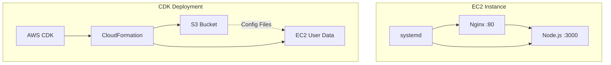

# 実装演習 EC2 Webサーバーの構築とCDKによる自動化

## 課題

### 要件

1. EC2インスタンス上でWebアプリケーションを公開
1. Nginx（リバースプロキシ）+ Node.js（アプリケーションサーバー）構成
1. systemdによるサービス管理
1. AWS CDKによるInfrastructure as Code実装

### 実装手順
1. EC2インスタンスの手動構築
1. トラブルシューティングを通じた問題解決
1. AWS CDKによる環境の再構築

## 構成図

### システム全体の通信フロー



## Part 1: 手動構築

### 1-1. EC2インスタンスの作成

Webサーバーを作成します。

AWSコンソールでEC2インスタンスを作成
   - Amazon Linux 2023 AMI
   - t3.micro (無料枠)
   - パブリックIPアドレスを有効化
   - キーペアを作成し、ダウンロード

AWSコンソールで以下のインバウンドルールを設定：

| タイプ | プロトコル | ポート範囲 | ソース | 説明 |
|--------|-----------|------------|--------|------|
| HTTP | TCP | 80 | 0.0.0.0/0 | Web traffic |
| SSH | TCP | 22 | Your IP | Management |

Your IP は自分のグローバルIPアドレスに置き換えてください。
https://inet-ip.info などで確認できます。

### 1-2. SSHでインスタンスに接続

手元端末からリモートで接続します。

WSLでの手順 (推奨)
   - 作成したキーペアを`~/.ssh/`に配置
   - パーミッションを設定 `chmod 400 ~/.ssh/your-key.pem`
   - 接続 `ssh -i ~/.ssh/your-key.pem ec2-user@your-ec2-public-ip`

PowerShellでの手順
   - 作成したキーペアを`C:\Users\YourUser\.ssh\`に配置
   - パーミッションを設定 `icacls C:\Users\YourUser\.ssh\your-key.pem /inheritance:r /grant:r YourUser:(R)`
   - 接続 `ssh -i C:\Users\YourUser\.ssh\your-key.pem ec2-user@your-ec2-public-ip`

#### サーバー上で使用できるエディタ
サーバー上で起動できるエディタは限られています。
- `nano` (Ctrlでの制御。スクリーン下部にコマンド一覧が表示される)
- `vi`, `vim` (モード切り替えで制御。 normalモード, insertモードなどがありコマンドを覚える必要がある)

本資料では各ファイルの先頭にファイルパスを記載するので、必要に応じて`nano /path/to/file`などとして編集してください。

### 1-3. Node.jsアプリケーションの実装

本体アプリケーションを実装します。

```javascript
// app.js (/home/ec2-user/app.js $HOME直下は以後省略して表記します)
const http = require('http');

const server = http.createServer((req, res) => {
  console.log(`${new Date().toISOString()} - ${req.method} ${req.url}`);
  res.writeHead(200, { 'Content-Type': 'text/html; charset=utf-8' });
  res.end(`
    <!DOCTYPE html>
    <html>
    <head>
      <title>Node app</title>
    </head>
    <body>
      <h1>Hello from Node.js App</h1>
      <p>Node.js application is running</p>
      <p>Current time: ${new Date().toISOString()}</p>
    </body>
    </html>
  `);
});

server.listen(3000, '127.0.0.1', () => {
  console.log('Server running at http://127.0.0.1:3000/');
});
```

##### 起動と確認

```bash
# 一時的な起動
node app.js

# 別のターミナルから確認
curl http://localhost:3000
curl -I http://localhost:3000  # ヘッダーのみ
curl -v http://localhost:3000  # 詳細表示
```

### 1-4. system serviceによるアプリケーションの常駐化

systemdでサービス化します。

先ほどの一時的な起動では、SSH接続が切れるとアプリケーションも停止してしまうためです。

```ini
# /etc/systemd/system/nodeapp.service
[Unit]
Description=Node.js Web Application
After=network.target
[Service]
Type=simple
User=ec2-user
WorkingDirectory=/home/ec2-user
ExecStart=/usr/bin/node /home/ec2-user/app.js
[Install]
WantedBy=multi-user.target
```

```bash
# サービスファイルを読み込み (新規作成・更新時に実行が必要)
sudo systemctl daemon-reload
# サービスの起動 (これで node app.js を実行したことになる)
sudo systemctl start nodeapp
# サービスの状態確認 (起動していれば active (running) となる)
sudo systemctl status nodeapp
# 自動起動の設定 (システムの再起動後も自動で起動するようにするための設定)
sudo systemctl enable nodeapp
# ログの確認 (-u は unit の意味でアプリケーション名を指定できる。-f は follow の意味でリアルタイムにログを追いかける)
sudo journalctl -u nodeapp -f
```

##### 起動と確認

```bash
sudo systemctl status nodeapp # これで起動している状態で
curl http://localhost:3000 # これでアプリケーションにアクセスできればOK
```

### 1-5. Nginxのインストールと設定

Webサーバーを作成します。

```bash
# Nginxのインストール
sudo dnf install -y nginx
# Nginxの起動
sudo systemctl start nginx
```

##### 起動と確認

```bash
curl http://localhost # Nginxのデフォルトページが表示されればOK
```

### 1-6. Nginxの設定

Nginx経由でNode.jsアプリケーションにアクセスできるようにします。

```nginx
# /etc/nginx/conf.d/nodeapp.conf

server {
    listen 80;
    server_name _;

    # アクセスログとエラーログ
    access_log /var/log/nginx/nodeapp.access.log;
    error_log /var/log/nginx/nodeapp.error.log;

    # プロキシ設定
    location / {
        proxy_pass http://localhost:3000;
        proxy_http_version 1.1;
        proxy_set_header Upgrade $http_upgrade;
        proxy_set_header Connection 'upgrade';
        proxy_set_header Host $host;
        proxy_cache_bypass $http_upgrade;
        proxy_set_header X-Real-IP $remote_addr;
        proxy_set_header X-Forwarded-For $proxy_add_x_forwarded_for;
    }
}
```

デフォルトの設定を無効化します

↓ こんな感じの部分を`#`でコメントアウト

```bash
# /etc/nginx/nginx.conf

# server {
#    listen       80 default_server;
#    listen       [::]:80 default_server;
#    server_name  _;
#    root         /usr/share/nginx/html;
#
#    # Load configuration files for the default server block.
# }
```

##### 起動と確認

```bash
sudo nginx -t # 設定ファイルの構文チェック
sudo systemctl restart nginx # Nginxの再起動
sudo systemctl status nginx # 状態確認
curl http://localhost # これでアプリケーションにアクセスできればOK
```

### 1-7. 外部からのアクセス確認
ブラウザで`http://your-ec2-public-ip`にアクセスして、Node.jsアプリケーションの画面が表示されれば成功です。


## Part 2: CDKでの構築

### 2-1. 事前準備

ローカル環境でNode.js, AWS CDKをインストールします。

```bash
node --version # 何か表示されればOK
aws --version # 何か表示されればOK
```

なければインストールしてください。

### 2-2. CDK開発の流れ
1. CDKプロジェクトの初期化
2. `npm run cdk -- deploy --require-approval never`でデプロイ
3. 動作確認
4. `npm run cdk -- destroy --force` で削除
5. うまくいくまで2〜4を繰り返す

※ここで使っている `--` は、「以降の引数・オプションがnpmではなくcdkに渡される」ことを意味します。
`npm run cdk deploy --require-approval never` とすると `--require-approval never` がnpmに渡されてしまい、意図した動作になりません。

### プロジェクト構造

```
cdk/
├── app/                           # アプリケーション関連はここに配置
│   └── app.js
└── infrastructure/                # インフラ関連はここに配置
     ├── cdk/
     │   ├── bin/
     │   │   └── webapp.ts       # CDKアプリのエントリポイント
     │   ├── lib/
     │   │   └── webapp-stack.ts # スタック(リソース)定義
     │   ├── cdk.json
     │   ├── package.json
     │   └── tsconfig.json
     └── configs/                  # CDKに直接書きたくない設定ファイル
          ├── nginx.conf
          └── nodeapp.service
```

### 2-3. CDK実装詳細

エントリーポイント

```typescript
// infrastructure/cdk/bin/webapp.ts
#!/usr/bin/env node
import 'source-map-support/register';
import * as cdk from 'aws-cdk-lib';
import { WebappStack } from '../lib/webapp-stack';

const app = new cdk.App();
new WebappStack(app, 'WebappStack', {
  env: {
    account: process.env.CDK_DEFAULT_ACCOUNT,
    region: process.env.CDK_DEFAULT_REGION
  }
});
```

スタック定義

```typescript
// infrastructure/cdk/lib/webapp-stack.ts

import * as cdk from 'aws-cdk-lib';
import * as ec2 from 'aws-cdk-lib/aws-ec2';
import * as s3 from 'aws-cdk-lib/aws-s3';
import * as s3deploy from 'aws-cdk-lib/aws-s3-deployment';
import { Construct } from 'constructs';
import * as path from 'path';
import * as fs from 'fs';

export class WebappStack extends cdk.Stack {
  constructor(scope: Construct, id: string, props?: cdk.StackProps) {
    super(scope, id, props);

    // VPCの取得（デフォルトVPCを使用）
    const vpc = ec2.Vpc.fromLookup(this, 'VPC', {
      isDefault: true
    });

    // セキュリティグループの作成
    const securityGroup = new ec2.SecurityGroup(this, 'WebappSecurityGroup', {
      vpc,
      description: 'Security group for webapp EC2 instance',
      allowAllOutbound: true
    });

    // HTTPアクセスを許可
    securityGroup.addIngressRule(
      ec2.Peer.anyIpv4(),
      ec2.Port.tcp(80),
      'Allow HTTP traffic'
    );

    // SSHアクセスを許可
    securityGroup.addIngressRule(
      ec2.Peer.anyIpv4(), // 一旦全許可
      ec2.Port.tcp(22),
      'Allow SSH access'
    );

    // S3バケットの作成（設定ファイル用）
    const configBucket = new s3.Bucket(this, 'ConfigBucket', {
      removalPolicy: cdk.RemovalPolicy.DESTROY,
      autoDeleteObjects: true
    });

    // 設定ファイルをS3にアップロード
    new s3deploy.BucketDeployment(this, 'DeployConfigs', {
      sources: [s3deploy.Source.asset(path.join(__dirname, '../../configs'))],
      destinationBucket: configBucket
    });

    // アプリケーションファイルをS3にアップロード
    new s3deploy.BucketDeployment(this, 'DeployApp', {
      sources: [s3deploy.Source.asset(path.join(__dirname, '../../../app'))],
      destinationBucket: configBucket,
      destinationKeyPrefix: 'app'
    });

    // User Dataスクリプトの作成 (EC2の初回起動時に実行されるスクリプト)
    const userData = ec2.UserData.forLinux();
    userData.addCommands(
      '#!/bin/bash',
      'set -e',
      '',
      '# パッケージの更新とインストール',
      'dnf update -y',
      'dnf install -y nginx aws-cli',
      '',
      '# Node.jsのインストール',
      'curl -sL https://rpm.nodesource.com/setup_22.x | bash -',
      'dnf install -y nodejs',
      '',
      '# S3から設定ファイルをダウンロード',
      `aws s3 cp s3://${configBucket.bucketName}/nginx.conf /etc/nginx/conf.d/nodeapp.conf`,
      `aws s3 cp s3://${configBucket.bucketName}/nodeapp.service /etc/systemd/system/nodeapp.service`,
      `aws s3 cp s3://${configBucket.bucketName}/app/app.js /home/ec2-user/app.js`,
      'chown ec2-user:ec2-user /home/ec2-user/app.js',
      '',
      '# デフォルトのNginx設定を無効化',
      'sed -i "s/^\\s*server {/# server {/" /etc/nginx/nginx.conf',
      'sed -i "s/^\\s*listen/# listen/" /etc/nginx/nginx.conf',
      'sed -i "s/^\\s*server_name/# server_name/" /etc/nginx/nginx.conf',
      'sed -i "s/^\\s*root/# root/" /etc/nginx/nginx.conf',
      'sed -i "s/^\\s*}/# }/" /etc/nginx/nginx.conf',
      '',
      '# サービスの起動',
      'systemctl daemon-reload',
      'systemctl enable nodeapp',
      'systemctl start nodeapp',
      'systemctl enable nginx',
      'systemctl start nginx'
    );

    // EC2インスタンスの作成
    const instance = new ec2.Instance(this, 'WebappInstance', {
      vpc,
      instanceType: ec2.InstanceType.of(ec2.InstanceClass.T3, ec2.InstanceSize.MICRO),
      machineImage: new ec2.AmazonLinuxImage({
        generation: ec2.AmazonLinuxGeneration.AMAZON_LINUX_2023
      }),
      securityGroup,
      userData,
      vpcSubnets: {
        subnetType: ec2.SubnetType.PUBLIC
      }
    });

    // S3バケットへのアクセス権限を付与
    configBucket.grantRead(instance);

    // 出力
    new cdk.CfnOutput(this, 'InstancePublicIP', {
      value: instance.instancePublicIp,
      description: 'Public IP address of the EC2 instance'
    });

    new cdk.CfnOutput(this, 'WebsiteURL', {
      value: `http://${instance.instancePublicIp}`,
      description: 'URL to access the web application'
    });
  }
}
```

##### 起動と確認

```bash
# CDKの初期化
cd infrastructure/cdk
npm install
npm run cdk bootstrap

# デプロイ
npm run cdk -- deploy --require-approval never

# ブラウザで http://出力されたIP にアクセスして確認

# 問題があれば削除
npm run cdk -- destroy --force
```


