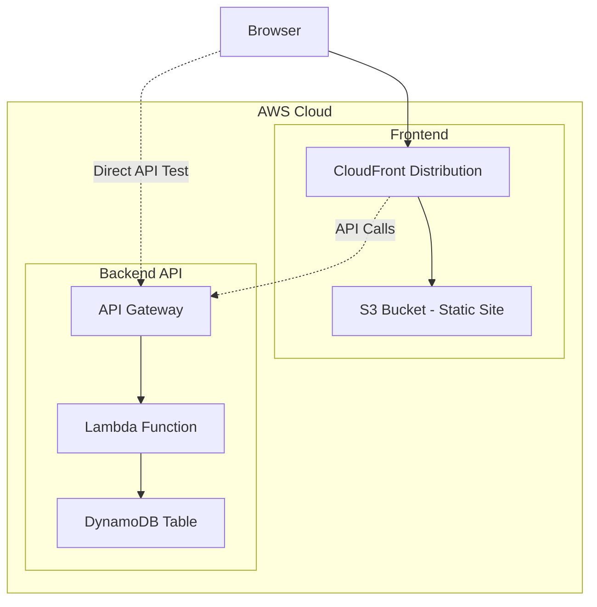

# 実装演習 TODO APIの構築とフロントエンド実装 (AWS CDK + Lambda + Next.js)

## 課題

### 要件

1. CRUD操作をサポートするREST API（Lambda + DynamoDB + API Gateway）
1. AWS CDKによるInfrastructure as Code実装
1. 静的にビルドしたNext.jsフロントエンドをS3でホスティング
1. CloudFrontによるコンテンツ配信

### 実装手順

段階的に実装を進めます。各ステップで動作確認を行い、問題があれば次に進む前に解決します。

1. CDKプロジェクトの初期化と環境構築
1. DynamoDBテーブルの作成（CDK）
1. Lambda関数の基本実装（Hello World）とデプロイ
1. API Gatewayの作成と疎通確認
1. Lambda関数とDynamoDBの連携確認
1. Read操作の実装（単一取得・一覧取得）
1. Create操作の実装
1. Update操作の実装
1. Delete操作の実装
1. 総合テスト（API動作確認）
1. フロントエンドの実装（HTML/CSS/JavaScript）
1. S3バケットの作成とホスティング設定（CDK）
1. フロントエンドとAPIの統合
1. Next.jsプロジェクトのセットアップ
1. Next.jsでのTODOアプリUI実装
1. Next.jsの静的ビルドとS3デプロイ
1. 最終確認とクリーンアップ

## 構成図

### システム全体の構成



クライアント（ブラウザ）は、CloudFront経由で静的サイト（Next.js）にアクセスします。
Next.jsアプリケーションは、API Gateway経由でLambda関数を呼び出し、Lambda関数がDynamoDBとやり取りします。

## Step 1: CDKプロジェクトの初期化と環境構築

### 前提条件

- Node.js 22以上がインストールされていること
- AWS CLIがインストールされ、認証情報が設定されていること
- AWS CDKがグローバルにインストールされていること

```bash
# Node.jsのバージョン確認
node --version

# AWS CLIの確認
aws --version

# AWS CDKのインストール（未インストールの場合）
npm install -g aws-cdk

# AWS CDKのバージョン確認
cdk --version
```

### AWS認証情報の設定

AWS CLIを使用するには、IAMアクセスキーを使った認証情報の設定が必要です。

#### IAMアクセスキーの取得方法

1. **AWSマネジメントコンソールにログイン**
   - https://console.aws.amazon.com/ にアクセス

2. **IAMサービスに移動**
   - 検索バーで「IAM」と入力し、「IAM」サービスを選択

3. **ユーザーの選択**
   - 左メニューから「ユーザー」を選択
   - 既存のユーザーを選択、または「ユーザーを作成」ボタンで新規作成
   - 新規作成の場合は、以下の権限を付与：
     - `AdministratorAccess`（開発環境の場合）
     - または必要最小限の権限：`AWSLambda_FullAccess`, `AmazonDynamoDBFullAccess`, `AmazonS3FullAccess`, `CloudFrontFullAccess`, `AmazonAPIGatewayAdministrator`, `IAMFullAccess`

4. **アクセスキーの作成**
   - ユーザー詳細ページの「セキュリティ認証情報」タブを選択
   - 「アクセスキーを作成」ボタンをクリック
   - ユースケースで「コマンドラインインターフェイス（CLI）」を選択
   - 確認チェックボックスにチェックを入れて「次へ」
   - 説明タグ（オプション）を入力して「アクセスキーを作成」

5. **認証情報のダウンロード**
   - **アクセスキーID**と**シークレットアクセスキー**が表示されます
   - 「.csvファイルをダウンロード」ボタンでダウンロード、または画面の値をメモ
   - **注意**: シークレットアクセスキーはこの画面でしか確認できません

#### aws configureの実行

ターミナルで以下のコマンドを実行し、取得した認証情報を設定します。

```bash
aws configure
```

以下の項目を順番に入力します：

```
AWS Access Key ID [None]: AKIA****************  # ← 取得したアクセスキーIDを入力
AWS Secret Access Key [None]: ****************************************  # ← 取得したシークレットアクセスキーを入力
Default region name [None]: ap-northeast-1  # ← 東京リージョン（推奨）
Default output format [None]: json  # ← json形式（推奨）
```

設定確認：

```bash
# 設定内容の確認
aws configure list

# 認証確認（IAMユーザー情報が表示されればOK）
aws sts get-caller-identity
```

### プロジェクト構造の作成

```bash
cd 03.cdk-lambda
mkdir -p infrastructure/cdk
mkdir -p backend/lambda
mkdir -p frontend
```

最終的なディレクトリ構成：

```
03.cdk-lambda/
├── README.md
├── infrastructure/
│   └── cdk/
│       ├── bin/
│       │   └── todo-app.ts
│       ├── lib/
│       │   └── todo-app-stack.ts
│       ├── cdk.json
│       ├── package.json
│       └── tsconfig.json
├── backend/
│   └── lambda/
│       ├── index.mjs
│       └── package.json
└── frontend/
    ├── simple/                    # Step 11で使用
    │   ├── index.html
    │   └── app.js
    └── nextjs/                    # Step 14-16で使用
        └── (Next.jsプロジェクト)
```

### CDKプロジェクトの初期化

```bash
cd infrastructure/cdk
cdk init app --language typescript
npm install
```

### CDKのブートストラップ

初回のみ必要です。CDKがデプロイに使用するS3バケットなどのリソースを作成します。

```bash
cdk bootstrap
```

### 動作確認

```bash
# CDKの構文チェック
npm run build

# 生成されるCloudFormationテンプレートの確認
cdk synth
```

エラーが出なければStep 1は完了です。

## Step 2: DynamoDBテーブルの作成（CDK）

### CDKスタックの実装

`infrastructure/cdk/lib/todo-app-stack.ts` を編集します。

```typescript
import * as cdk from 'aws-cdk-lib';
import * as dynamodb from 'aws-cdk-lib/aws-dynamodb';
import { Construct } from 'constructs';

export class TodoAppStack extends cdk.Stack {
  constructor(scope: Construct, id: string, props?: cdk.StackProps) {
    super(scope, id, props);

    // DynamoDBテーブルの作成
    // 衝突しない名前を設定してください
    const tableName = 'TableName';
    const table = new dynamodb.Table(this, 'TodoTable', {
      tableName: tableName,
      partitionKey: {
        name: 'id',
        type: dynamodb.AttributeType.STRING
      },
      billingMode: dynamodb.BillingMode.PAY_PER_REQUEST,
      removalPolicy: cdk.RemovalPolicy.DESTROY, // 開発環境用：スタック削除時にテーブルも削除
    });

    // テーブル名を出力
    new cdk.CfnOutput(this, 'TodoTableName', {
      value: table.tableName,
      description: 'DynamoDB Table Name'
    });
  }
}
```

### デプロイ

```bash
cd infrastructure/cdk
npm run build
cdk deploy --require-approval never
```

### 動作確認

AWS Management Consoleで以下を確認：
1. CloudFormationスタックが正常に作成されていること
1. DynamoDBテーブルが作成されていること

またはCLIで確認：

```bash
aws dynamodb list-tables
```

出力された`TodoTableName`をメモしておきます。

## Step 3: Lambda関数の基本実装（Hello World）とデプロイ

### Lambda関数の実装

`backend/lambda/index.mjs` を作成します。

```javascript
export const handler = async (event) => {
  console.log("Event:", JSON.stringify(event, null, 2));

  return {
    statusCode: 200,
    headers: {
      "Content-Type": "application/json",
      "Access-Control-Allow-Origin": "*",
      "Access-Control-Allow-Headers": "Content-Type",
      "Access-Control-Allow-Methods": "GET,POST,PUT,DELETE,OPTIONS"
    },
    body: JSON.stringify({ message: "Hello from Lambda!" })
  };
};
```

### package.jsonの作成

`backend/lambda/package.json` を作成します。

```json
{
  "name": "todo-api-lambda",
  "version": "1.0.0",
  "type": "module",
  "dependencies": {
    "@aws-sdk/client-dynamodb": "^3.0.0",
    "@aws-sdk/lib-dynamodb": "^3.0.0"
  }
}
```

### CDKスタックにLambda関数を追加

`infrastructure/cdk/lib/todo-app-stack.ts` を更新します。

```typescript
import * as cdk from 'aws-cdk-lib';
import * as dynamodb from 'aws-cdk-lib/aws-dynamodb';
import * as lambda from 'aws-cdk-lib/aws-lambda';
import { Construct } from 'constructs';
import * as path from 'path';

export class TodoAppStack extends cdk.Stack {
  constructor(scope: Construct, id: string, props?: cdk.StackProps) {
    super(scope, id, props);

    // DynamoDBテーブルの作成
    // 衝突しない名前を設定してください
    const tableName = 'TableName';
    const table = new dynamodb.Table(this, 'TodoTable', {
      tableName: tableName,
      partitionKey: {
        name: 'id',
        type: dynamodb.AttributeType.STRING
      },
      billingMode: dynamodb.BillingMode.PAY_PER_REQUEST,
      removalPolicy: cdk.RemovalPolicy.DESTROY,
    });

    // Lambda関数の作成
    // 衝突しない名前を設定してください
    const functionName = 'FunctionName';
    const todoFunction = new lambda.Function(this, 'TodoFunction', {
      functionName: functionName,
      runtime: lambda.Runtime.NODEJS_22_X,
      handler: 'index.handler',
      code: lambda.Code.fromAsset(path.join(__dirname, '../../../backend/lambda')),
      environment: {
        TABLE_NAME: table.tableName
      },
      timeout: cdk.Duration.seconds(10)
    });

    // Lambda関数にDynamoDBテーブルへのアクセス権限を付与
    table.grantReadWriteData(todoFunction);

    // 出力
    new cdk.CfnOutput(this, 'TodoTableName', {
      value: table.tableName,
      description: 'DynamoDB Table Name'
    });

    new cdk.CfnOutput(this, 'TodoFunctionName', {
      value: todoFunction.functionName,
      description: 'Lambda Function Name'
    });
  }
}
```

### デプロイ

```bash
cd infrastructure/cdk
npm run build
cdk deploy --require-approval never
```

### 動作確認

Lambda関数を直接テストします。

```bash
# 出力されたLambda関数名を使用
aws lambda invoke \
  --function-name <TodoFunctionName> \
  --payload '{}' \
  response.json

cat response.json
```

`{"message": "Hello from Lambda!"}` が返ってくればOKです。

## Step 4: API Gatewayの作成と疎通確認

### CDKスタックにAPI Gatewayを追加

`infrastructure/cdk/lib/todo-app-stack.ts` を更新します。

```typescript
import * as cdk from 'aws-cdk-lib';
import * as dynamodb from 'aws-cdk-lib/aws-dynamodb';
import * as lambda from 'aws-cdk-lib/aws-lambda';
import * as apigateway from 'aws-cdk-lib/aws-apigateway';
import { Construct } from 'constructs';
import * as path from 'path';

export class TodoAppStack extends cdk.Stack {
  constructor(scope: Construct, id: string, props?: cdk.StackProps) {
    super(scope, id, props);

    // DynamoDBテーブルの作成
    // 衝突しない名前を設定してください
    const tableName = 'TableName';
    const table = new dynamodb.Table(this, 'TodoTable', {
      tableName: tableName,
      partitionKey: {
        name: 'id',
        type: dynamodb.AttributeType.STRING
      },
      billingMode: dynamodb.BillingMode.PAY_PER_REQUEST,
      removalPolicy: cdk.RemovalPolicy.DESTROY,
    });

    // Lambda関数の作成
    // 衝突しない名前を設定してください
    const functionName = 'FunctionName';
    const todoFunction = new lambda.Function(this, 'TodoFunction', {
      functionName: functionName,
      runtime: lambda.Runtime.NODEJS_22_X,
      handler: 'index.handler',
      code: lambda.Code.fromAsset(path.join(__dirname, '../../../backend/lambda')),
      environment: {
        TABLE_NAME: table.tableName
      },
      timeout: cdk.Duration.seconds(10)
    });

    // Lambda関数にDynamoDBテーブルへのアクセス権限を付与
    table.grantReadWriteData(todoFunction);

    // API Gatewayの作成
    // 衝突しない名前を設定してください
    const apiName = 'ApiName';
    const api = new apigateway.RestApi(this, 'TodoApi', {
      restApiName: apiName,
      description: 'Todo API with Lambda and DynamoDB',
      defaultCorsPreflightOptions: {
        allowOrigins: apigateway.Cors.ALL_ORIGINS,
        allowMethods: apigateway.Cors.ALL_METHODS,
        allowHeaders: ['Content-Type', 'Authorization']
      }
    });

    // Lambda統合の作成
    const todoIntegration = new apigateway.LambdaIntegration(todoFunction);

    // /todos エンドポイントの作成
    const todos = api.root.addResource('todos');
    todos.addMethod('ANY', todoIntegration); // すべてのHTTPメソッドを許可

    // /todos/{id} エンドポイントの作成
    const todoItem = todos.addResource('{id}');
    todoItem.addMethod('ANY', todoIntegration);

    // 出力
    new cdk.CfnOutput(this, 'TodoTableName', {
      value: table.tableName,
      description: 'DynamoDB Table Name'
    });

    new cdk.CfnOutput(this, 'TodoFunctionName', {
      value: todoFunction.functionName,
      description: 'Lambda Function Name'
    });

    new cdk.CfnOutput(this, 'ApiEndpoint', {
      value: api.url,
      description: 'API Gateway Endpoint'
    });
  }
}
```

### デプロイ

```bash
cd infrastructure/cdk
npm run build
cdk deploy --require-approval never
```

### 動作確認

出力された`ApiEndpoint`を使用してテストします。

```bash
# GETリクエスト
curl https://<ApiEndpoint>/todos

# ブラウザでもアクセス可能
```

`{"message": "Hello from Lambda!"}` が返ってくればOKです。

## Step 5: Lambda関数とDynamoDBの連携確認

### Lambda関数を更新

`backend/lambda/index.mjs` を更新して、DynamoDBにテストデータを書き込みます。

```javascript
import { DynamoDBClient } from "@aws-sdk/client-dynamodb";
import { DynamoDBDocumentClient, PutCommand } from "@aws-sdk/lib-dynamodb";

const ddb = DynamoDBDocumentClient.from(new DynamoDBClient({}));
const TABLE_NAME = process.env.TABLE_NAME;

export const handler = async (event) => {
  console.log("Event:", JSON.stringify(event, null, 2));

  // テストデータをDynamoDBに保存
  const testItem = {
    id: crypto.randomUUID(),
    message: "Hello, DynamoDB!",
    createdAt: new Date().toISOString()
  };

  await ddb.send(new PutCommand({
    TableName: TABLE_NAME,
    Item: testItem
  }));

  return {
    statusCode: 200,
    headers: {
      "Content-Type": "application/json",
      "Access-Control-Allow-Origin": "*",
      "Access-Control-Allow-Headers": "Content-Type",
      "Access-Control-Allow-Methods": "GET,POST,PUT,DELETE,OPTIONS"
    },
    body: JSON.stringify({
      message: "Data saved to DynamoDB!",
      item: testItem
    })
  };
};
```

### デプロイと確認

```bash
cd infrastructure/cdk
npm run build
cdk deploy --require-approval never

# API経由でアクセス
curl https://<ApiEndpoint>/todos
```

毎回アクセスするたびに新しいデータがDynamoDBに保存されます。
AWS Management ConsoleのDynamoDBテーブルでデータが保存されていることを確認してください。

## Step 6: Read操作の実装（単一取得・一覧取得）

### Lambda関数を更新

`backend/lambda/index.mjs` を更新して、CRUD操作を実装します。

```javascript
import { DynamoDBClient } from "@aws-sdk/client-dynamodb";
import { DynamoDBDocumentClient, PutCommand, GetCommand, ScanCommand, UpdateCommand, DeleteCommand } from "@aws-sdk/lib-dynamodb";

const ddb = DynamoDBDocumentClient.from(new DynamoDBClient({}));
const TABLE_NAME = process.env.TABLE_NAME;

// JSONレスポンスを返すためのユーティリティ
const json = (statusCode, body = {}) => ({
  statusCode,
  headers: {
    "Content-Type": "application/json",
    "Access-Control-Allow-Origin": "*",
    "Access-Control-Allow-Headers": "Content-Type",
    "Access-Control-Allow-Methods": "GET,POST,PUT,DELETE,OPTIONS"
  },
  body: JSON.stringify(body)
});

// リクエストボディをパースするユーティリティ
const parseBody = (event) => {
  try {
    return event.body ? JSON.parse(event.body) : {};
  } catch {
    return null;
  }
};

// パスの判定
const isTodosRoot = (path) => /^\/todos\/?$/.test(path);
const isTodosById = (path) => /^\/todos\/([^/]+)\/?$/.test(path);
const idFromPath = (path) => path.split("/").filter(Boolean).pop();

export const handler = async (event) => {
  const method = event.requestContext?.http?.method || event.httpMethod;
  const path = event.requestContext?.http?.path || event.rawPath || event.path;

  console.log(`${method} ${path}`);

  // OPTIONSはCORS対応のために常に200を返す
  if (method === "OPTIONS") {
    return json(200, { ok: true });
  }

  try {
    // ID指定での取得
    if (method === "GET" && isTodosById(path)) {
      const id = idFromPath(path);
      const res = await ddb.send(new GetCommand({
        TableName: TABLE_NAME,
        Key: { id }
      }));

      if (!res.Item) {
        return json(404, { message: "not found" });
      }

      return json(200, res.Item);
    }

    // 一覧取得
    if (method === "GET" && isTodosRoot(path)) {
      const limit = Math.min(
        Number(event.queryStringParameters?.limit) || 20,
        100
      );
      const cursor = event.queryStringParameters?.cursor;
      const ExclusiveStartKey = cursor
        ? JSON.parse(Buffer.from(cursor, "base64").toString("utf8"))
        : undefined;

      const res = await ddb.send(new ScanCommand({
        TableName: TABLE_NAME,
        Limit: limit,
        ExclusiveStartKey
      }));

      const nextCursor = res.LastEvaluatedKey
        ? Buffer.from(JSON.stringify(res.LastEvaluatedKey)).toString("base64")
        : null;

      return json(200, {
        items: res.Items || [],
        nextCursor
      });
    }

    return json(404, { message: "route not found" });

  } catch (err) {
    console.error(err);
    return json(500, { message: err.message || "error" });
  }
};
```

### デプロイと確認

```bash
cd infrastructure/cdk
npm run build
cdk deploy --require-approval never

# 一覧取得
curl https://<ApiEndpoint>/todos

# ID指定で取得（前のステップで作成したIDを使用）
curl https://<ApiEndpoint>/todos/<id>
```

## Step 7: Create操作の実装

### Lambda関数を更新

`backend/lambda/index.mjs` の`handler`関数に以下を追加します。

```javascript
export const handler = async (event) => {
  const method = event.requestContext?.http?.method || event.httpMethod;
  const path = event.requestContext?.http?.path || event.rawPath || event.path;

  console.log(`${method} ${path}`);

  if (method === "OPTIONS") {
    return json(200, { ok: true });
  }

  try {
    // ID指定での取得
    if (method === "GET" && isTodosById(path)) {
      // ... (Step 6のコード)
    }

    // 一覧取得
    if (method === "GET" && isTodosRoot(path)) {
      // ... (Step 6のコード)
    }

    // 新規作成
    if (method === "POST" && isTodosRoot(path)) {
      const body = parseBody(event);
      if (!body) return json(400, { message: "invalid JSON" });

      const { title, dueDate = null } = body;
      if (!title || typeof title !== "string") {
        return json(400, { message: "title is required" });
      }

      const id = crypto.randomUUID();
      const now = new Date().toISOString();
      const item = {
        id,
        title,
        completed: false,
        dueDate,
        createdAt: now,
        updatedAt: now
      };

      await ddb.send(new PutCommand({
        TableName: TABLE_NAME,
        Item: item
      }));

      return json(201, item);
    }

    return json(404, { message: "route not found" });

  } catch (err) {
    console.error(err);
    return json(500, { message: err.message || "error" });
  }
};
```

### デプロイと確認

```bash
cd infrastructure/cdk
npm run build
cdk deploy --require-approval never

# POSTリクエストでTODOを作成
curl -X POST https://<ApiEndpoint>/todos \
  -H "Content-Type: application/json" \
  -d '{"title": "First Task", "dueDate": "2025-12-31"}'
```

作成されたTODOアイテムがJSON形式で返ってくればOKです。

## Step 8: Update操作の実装

### Lambda関数を更新

`backend/lambda/index.mjs` の`handler`関数に以下を追加します。

```javascript
export const handler = async (event) => {
  // ... (前のコード)

  try {
    // ... (GET, POST のコード)

    // 更新
    if (method === "PUT" && isTodosById(path)) {
      const id = idFromPath(path);
      const body = parseBody(event);
      if (!body) return json(400, { message: "invalid JSON" });

      const allowed = {};
      if ("title" in body) allowed.title = body.title;
      if ("completed" in body) allowed.completed = body.completed;
      if ("dueDate" in body) allowed.dueDate = body.dueDate;

      const exprNames = {};
      const exprValues = { ":u": new Date().toISOString() };
      const sets = ["#u = :u"];

      for (const [k, v] of Object.entries(allowed)) {
        const nameKey = `#${k}`;
        const valueKey = `:${k}`;
        exprNames[nameKey] = k;
        exprValues[valueKey] = v;
        sets.push(`${nameKey} = ${valueKey}`);
      }

      if (sets.length === 1) {
        return json(400, { message: "no updatable fields" });
      }

      const res = await ddb.send(new UpdateCommand({
        TableName: TABLE_NAME,
        Key: { id },
        ConditionExpression: "attribute_exists(id)",
        UpdateExpression: `SET ${sets.join(", ")}`,
        ExpressionAttributeNames: { "#u": "updatedAt", ...exprNames },
        ExpressionAttributeValues: exprValues,
        ReturnValues: "ALL_NEW"
      }));

      return json(200, res.Attributes);
    }

    return json(404, { message: "route not found" });

  } catch (err) {
    console.error(err);
    const code = err.name === "ConditionalCheckFailedException" ? 404 : 500;
    return json(code, { message: err.message || "error" });
  }
};
```

### デプロイと確認

```bash
cd infrastructure/cdk
npm run build
cdk deploy --require-approval never

# 更新（completedをtrueに変更）
curl -X PUT https://<ApiEndpoint>/todos/<id> \
  -H "Content-Type: application/json" \
  -d '{"completed": true}'
```

## Step 9: Delete操作の実装

### Lambda関数を更新

`backend/lambda/index.mjs` の`handler`関数に以下を追加します。

```javascript
export const handler = async (event) => {
  // ... (前のコード)

  try {
    // ... (GET, POST, PUT のコード)

    // 削除
    if (method === "DELETE" && isTodosById(path)) {
      const id = idFromPath(path);

      await ddb.send(new DeleteCommand({
        TableName: TABLE_NAME,
        Key: { id },
        ConditionExpression: "attribute_exists(id)"
      }));

      return {
        statusCode: 204,
        headers: {
          "Access-Control-Allow-Origin": "*"
        }
      };
    }

    return json(404, { message: "route not found" });

  } catch (err) {
    console.error(err);
    const code = err.name === "ConditionalCheckFailedException" ? 404 : 500;
    return json(code, { message: err.message || "error" });
  }
};
```

### デプロイと確認

```bash
cd infrastructure/cdk
npm run build
cdk deploy --require-approval never

# 削除
curl -X DELETE https://<ApiEndpoint>/todos/<id>

# 削除確認（404が返ってくるはず）
curl https://<ApiEndpoint>/todos/<id>
```

## Step 10: 総合テスト（API動作確認）

### 一連の操作をテスト

```bash
# 1. TODOを作成
RESPONSE=$(curl -X POST https://<ApiEndpoint>/todos \
  -H "Content-Type: application/json" \
  -d '{"title": "Test Task", "dueDate": "2025-12-31"}')

echo $RESPONSE

# 2. 作成したTODOのIDを取得
TODO_ID=$(echo $RESPONSE | jq -r '.id')

# 3. ID指定で取得
curl https://<ApiEndpoint>/todos/$TODO_ID

# 4. 一覧取得
curl https://<ApiEndpoint>/todos

# 5. 更新
curl -X PUT https://<ApiEndpoint>/todos/$TODO_ID \
  -H "Content-Type: application/json" \
  -d '{"completed": true}'

# 6. 削除
curl -X DELETE https://<ApiEndpoint>/todos/$TODO_ID

# 7. 削除確認
curl https://<ApiEndpoint>/todos/$TODO_ID
```

すべての操作が正常に動作すればStep 10は完了です。

## Step 11: フロントエンドの実装（HTML/CSS/JavaScript）

Next.jsに進む前に、まずシンプルなHTML/CSS/JavaScriptでフロントエンドを作成します。

### ファイルの作成

`frontend/simple/index.html` を作成します。

```html
<!DOCTYPE html>
<html lang="ja">
<head>
  <meta charset="UTF-8">
  <meta name="viewport" content="width=device-width, initial-scale=1.0">
  <title>TODO App</title>
  <style>
    * {
      margin: 0;
      padding: 0;
      box-sizing: border-box;
    }

    body {
      font-family: -apple-system, BlinkMacSystemFont, 'Segoe UI', Roboto, sans-serif;
      background: #f5f5f5;
      padding: 20px;
    }

    .container {
      max-width: 600px;
      margin: 0 auto;
      background: white;
      border-radius: 8px;
      padding: 24px;
      box-shadow: 0 2px 8px rgba(0,0,0,0.1);
    }

    h1 {
      margin-bottom: 24px;
      color: #333;
    }

    .input-group {
      display: flex;
      gap: 8px;
      margin-bottom: 24px;
    }

    input[type="text"] {
      flex: 1;
      padding: 12px;
      border: 1px solid #ddd;
      border-radius: 4px;
      font-size: 14px;
    }

    button {
      padding: 12px 24px;
      background: #007bff;
      color: white;
      border: none;
      border-radius: 4px;
      cursor: pointer;
      font-size: 14px;
    }

    button:hover {
      background: #0056b3;
    }

    button.delete {
      background: #dc3545;
      padding: 8px 16px;
    }

    button.delete:hover {
      background: #c82333;
    }

    .todo-list {
      list-style: none;
    }

    .todo-item {
      display: flex;
      align-items: center;
      gap: 12px;
      padding: 12px;
      border-bottom: 1px solid #eee;
    }

    .todo-item:last-child {
      border-bottom: none;
    }

    .todo-item input[type="checkbox"] {
      width: 20px;
      height: 20px;
      cursor: pointer;
    }

    .todo-item span {
      flex: 1;
      color: #333;
    }

    .todo-item.completed span {
      text-decoration: line-through;
      color: #999;
    }

    .error {
      color: #dc3545;
      margin-bottom: 16px;
      padding: 12px;
      background: #f8d7da;
      border-radius: 4px;
    }
  </style>
</head>
<body>
  <div class="container">
    <h1>TODO App</h1>
    <div id="error" class="error" style="display: none;"></div>
    <div class="input-group">
      <input type="text" id="todoInput" placeholder="新しいタスクを入力...">
      <button onclick="addTodo()">追加</button>
    </div>
    <ul id="todoList" class="todo-list"></ul>
  </div>

  <script src="app.js"></script>
</body>
</html>
```

`frontend/simple/app.js` を作成します。

```javascript
// API Endpoint を設定してください
const API_ENDPOINT = 'https://YOUR_API_ENDPOINT/todos';

// エラー表示
function showError(message) {
  const errorDiv = document.getElementById('error');
  errorDiv.textContent = message;
  errorDiv.style.display = 'block';
  setTimeout(() => {
    errorDiv.style.display = 'none';
  }, 5000);
}

// TODOを取得
async function fetchTodos() {
  try {
    const response = await fetch(API_ENDPOINT);
    if (!response.ok) throw new Error('Failed to fetch todos');
    const data = await response.json();
    renderTodos(data.items || []);
  } catch (error) {
    console.error('Error:', error);
    showError('TODOの取得に失敗しました');
  }
}

// TODOを表示
function renderTodos(todos) {
  const todoList = document.getElementById('todoList');
  todoList.innerHTML = '';

  todos.forEach(todo => {
    const li = document.createElement('li');
    li.className = `todo-item ${todo.completed ? 'completed' : ''}`;

    li.innerHTML = `
      <input type="checkbox" ${todo.completed ? 'checked' : ''} onchange="toggleTodo('${todo.id}', ${!todo.completed})">
      <span>${todo.title}</span>
      <button class="delete" onclick="deleteTodo('${todo.id}')">削除</button>
    `;

    todoList.appendChild(li);
  });
}

// TODOを追加
async function addTodo() {
  const input = document.getElementById('todoInput');
  const title = input.value.trim();

  if (!title) return;

  try {
    const response = await fetch(API_ENDPOINT, {
      method: 'POST',
      headers: {
        'Content-Type': 'application/json'
      },
      body: JSON.stringify({ title })
    });

    if (!response.ok) throw new Error('Failed to add todo');

    input.value = '';
    fetchTodos();
  } catch (error) {
    console.error('Error:', error);
    showError('TODOの追加に失敗しました');
  }
}

// TODOの完了状態を切り替え
async function toggleTodo(id, completed) {
  try {
    const response = await fetch(`${API_ENDPOINT}/${id}`, {
      method: 'PUT',
      headers: {
        'Content-Type': 'application/json'
      },
      body: JSON.stringify({ completed })
    });

    if (!response.ok) throw new Error('Failed to update todo');

    fetchTodos();
  } catch (error) {
    console.error('Error:', error);
    showError('TODOの更新に失敗しました');
  }
}

// TODOを削除
async function deleteTodo(id) {
  try {
    const response = await fetch(`${API_ENDPOINT}/${id}`, {
      method: 'DELETE'
    });

    if (!response.ok) throw new Error('Failed to delete todo');

    fetchTodos();
  } catch (error) {
    console.error('Error:', error);
    showError('TODOの削除に失敗しました');
  }
}

// Enterキーで追加
document.getElementById('todoInput').addEventListener('keypress', (e) => {
  if (e.key === 'Enter') {
    addTodo();
  }
});

// 初期ロード
fetchTodos();
```

### ローカルで動作確認

`app.js`の`API_ENDPOINT`を実際のAPI Gatewayエンドポイントに書き換えてください。

その後、ブラウザで`frontend/simple/index.html`を開いて動作確認します。

## Step 12: S3バケットの作成とホスティング設定（CDK）

### CDKスタックにS3バケットとCloudFrontを追加

`infrastructure/cdk/lib/todo-app-stack.ts` を更新します。

```typescript
import * as cdk from 'aws-cdk-lib';
import * as dynamodb from 'aws-cdk-lib/aws-dynamodb';
import * as lambda from 'aws-cdk-lib/aws-lambda';
import * as apigateway from 'aws-cdk-lib/aws-apigateway';
import * as s3 from 'aws-cdk-lib/aws-s3';
import * as s3deploy from 'aws-cdk-lib/aws-s3-deployment';
import * as cloudfront from 'aws-cdk-lib/aws-cloudfront';
import * as origins from 'aws-cdk-lib/aws-cloudfront-origins';
import { Construct } from 'constructs';
import * as path from 'path';

export class TodoAppStack extends cdk.Stack {
  constructor(scope: Construct, id: string, props?: cdk.StackProps) {
    super(scope, id, props);

    // ... (既存のDynamoDB, Lambda, API Gatewayのコード)

    // フロントエンド用S3バケットの作成
    // 衝突しない名前を設定してください
    const bucketName = 'BucketName';
    const websiteBucket = new s3.Bucket(this, 'WebsiteBucket', {
      bucketName: bucketName,
      removalPolicy: cdk.RemovalPolicy.DESTROY,
      autoDeleteObjects: true,
      websiteIndexDocument: 'index.html',
      websiteErrorDocument: 'index.html',
      publicReadAccess: false,
      blockPublicAccess: s3.BlockPublicAccess.BLOCK_ALL
    });

    // CloudFrontディストリビューションの作成
    const distribution = new cloudfront.Distribution(this, 'WebsiteDistribution', {
      defaultBehavior: {
        origin: new origins.S3Origin(websiteBucket),
        viewerProtocolPolicy: cloudfront.ViewerProtocolPolicy.REDIRECT_TO_HTTPS
      },
      defaultRootObject: 'index.html',
      errorResponses: [
        {
          httpStatus: 404,
          responseHttpStatus: 200,
          responsePagePath: '/index.html'
        }
      ]
    });

    // 出力
    new cdk.CfnOutput(this, 'WebsiteURL', {
      value: `https://${distribution.distributionDomainName}`,
      description: 'Website URL'
    });

    new cdk.CfnOutput(this, 'WebsiteBucketName', {
      value: websiteBucket.bucketName,
      description: 'S3 Bucket Name for Website'
    });

    // ... (既存の出力)
  }
}
```

### デプロイ

```bash
cd infrastructure/cdk
npm run build
cdk deploy --require-approval never
```

出力された`WebsiteBucketName`と`WebsiteURL`をメモしておきます。

## Step 13: フロントエンドとAPIの統合

### フロントエンドファイルの準備

`frontend/simple/app.js`の`API_ENDPOINT`を実際のAPI Gatewayエンドポイントに書き換えます。

### S3にアップロード

```bash
cd frontend/simple

# S3バケットにファイルをアップロード
aws s3 cp index.html s3://<WebsiteBucketName>/
aws s3 cp app.js s3://<WebsiteBucketName>/

# CloudFrontのキャッシュをクリア（必要に応じて）
aws cloudfront create-invalidation \
  --distribution-id <DistributionId> \
  --paths "/*"
```

DistributionIdはAWS Management ConsoleのCloudFrontページで確認できます。

### 動作確認

ブラウザで`WebsiteURL`にアクセスして、TODOアプリが動作することを確認します。

## Step 14: Next.jsプロジェクトのセットアップ

### Next.jsプロジェクトの作成

```bash
cd frontend
npx create-next-app@latest nextjs --typescript --tailwind --app --no-src-dir --import-alias "@/*"
cd nextjs
```

インタラクティブな質問には以下のように回答します：
- Would you like to use TypeScript? Yes
- Would you like to use ESLint? Yes
- Would you like to use Tailwind CSS? Yes
- Would you like to use `src/` directory? No
- Would you like to use App Router? Yes
- Would you like to customize the default import alias? No

### 静的エクスポートの設定

`frontend/nextjs/next.config.ts` を編集します。

```typescript
import type { NextConfig } from "next";

const nextConfig: NextConfig = {
  output: 'export',
  images: {
    unoptimized: true
  }
};

export default nextConfig;
```

### 動作確認

```bash
npm run dev
```

ブラウザで`http://localhost:3000`にアクセスして、Next.jsのデフォルトページが表示されればOKです。

## Step 15: Next.jsでのTODOアプリUI実装

### 環境変数の設定

`frontend/nextjs/.env.local` を作成します。

```bash
NEXT_PUBLIC_API_ENDPOINT=https://YOUR_API_ENDPOINT/todos
```

実際のAPI Gatewayエンドポイントに置き換えてください。

### TODOアプリの実装

`frontend/nextjs/app/page.tsx` を編集します。

```typescript
'use client';

import { useState, useEffect } from 'react';

interface Todo {
  id: string;
  title: string;
  completed: boolean;
  dueDate?: string;
  createdAt: string;
  updatedAt: string;
}

export default function Home() {
  const [todos, setTodos] = useState<Todo[]>([]);
  const [newTodo, setNewTodo] = useState('');
  const [error, setError] = useState('');
  const [loading, setLoading] = useState(false);

  const API_ENDPOINT = process.env.NEXT_PUBLIC_API_ENDPOINT || '';

  useEffect(() => {
    fetchTodos();
  }, []);

  const fetchTodos = async () => {
    try {
      setLoading(true);
      const response = await fetch(API_ENDPOINT);
      if (!response.ok) throw new Error('Failed to fetch todos');
      const data = await response.json();
      setTodos(data.items || []);
      setError('');
    } catch (err) {
      console.error('Error:', err);
      setError('TODOの取得に失敗しました');
    } finally {
      setLoading(false);
    }
  };

  const addTodo = async () => {
    if (!newTodo.trim()) return;

    try {
      const response = await fetch(API_ENDPOINT, {
        method: 'POST',
        headers: {
          'Content-Type': 'application/json'
        },
        body: JSON.stringify({ title: newTodo })
      });

      if (!response.ok) throw new Error('Failed to add todo');

      setNewTodo('');
      fetchTodos();
      setError('');
    } catch (err) {
      console.error('Error:', err);
      setError('TODOの追加に失敗しました');
    }
  };

  const toggleTodo = async (id: string, completed: boolean) => {
    try {
      const response = await fetch(`${API_ENDPOINT}/${id}`, {
        method: 'PUT',
        headers: {
          'Content-Type': 'application/json'
        },
        body: JSON.stringify({ completed })
      });

      if (!response.ok) throw new Error('Failed to update todo');

      fetchTodos();
      setError('');
    } catch (err) {
      console.error('Error:', err);
      setError('TODOの更新に失敗しました');
    }
  };

  const deleteTodo = async (id: string) => {
    try {
      const response = await fetch(`${API_ENDPOINT}/${id}`, {
        method: 'DELETE'
      });

      if (!response.ok) throw new Error('Failed to delete todo');

      fetchTodos();
      setError('');
    } catch (err) {
      console.error('Error:', err);
      setError('TODOの削除に失敗しました');
    }
  };

  return (
    <div className="min-h-screen bg-gray-100 py-8 px-4">
      <div className="max-w-2xl mx-auto">
        <div className="bg-white rounded-lg shadow-md p-6">
          <h1 className="text-3xl font-bold text-gray-800 mb-6">TODO App</h1>

          {error && (
            <div className="bg-red-100 border border-red-400 text-red-700 px-4 py-3 rounded mb-4">
              {error}
            </div>
          )}

          <div className="flex gap-2 mb-6">
            <input
              type="text"
              value={newTodo}
              onChange={(e) => setNewTodo(e.target.value)}
              onKeyPress={(e) => e.key === 'Enter' && addTodo()}
              placeholder="新しいタスクを入力..."
              className="flex-1 px-4 py-2 border border-gray-300 rounded-md focus:outline-none focus:ring-2 focus:ring-blue-500"
            />
            <button
              onClick={addTodo}
              className="px-6 py-2 bg-blue-500 text-white rounded-md hover:bg-blue-600 focus:outline-none focus:ring-2 focus:ring-blue-500"
            >
              追加
            </button>
          </div>

          {loading ? (
            <div className="text-center py-4">読み込み中...</div>
          ) : (
            <ul className="space-y-2">
              {todos.map((todo) => (
                <li
                  key={todo.id}
                  className="flex items-center gap-3 p-3 border-b border-gray-200 last:border-b-0"
                >
                  <input
                    type="checkbox"
                    checked={todo.completed}
                    onChange={(e) => toggleTodo(todo.id, e.target.checked)}
                    className="w-5 h-5 cursor-pointer"
                  />
                  <span
                    className={`flex-1 ${
                      todo.completed ? 'line-through text-gray-400' : 'text-gray-700'
                    }`}
                  >
                    {todo.title}
                  </span>
                  <button
                    onClick={() => deleteTodo(todo.id)}
                    className="px-4 py-1 bg-red-500 text-white rounded hover:bg-red-600 focus:outline-none focus:ring-2 focus:ring-red-500"
                  >
                    削除
                  </button>
                </li>
              ))}
            </ul>
          )}
        </div>
      </div>
    </div>
  );
}
```

### ローカルで動作確認

```bash
npm run dev
```

ブラウザで`http://localhost:3000`にアクセスして、APIと連携したTODOアプリが動作することを確認します。

## Step 16: Next.jsの静的ビルドとS3デプロイ

### 静的ビルド

```bash
cd frontend/nextjs
npm run build
```

ビルドされたファイルは`out/`ディレクトリに出力されます。

### S3にデプロイ

```bash
# S3バケットにアップロード
aws s3 sync out/ s3://<WebsiteBucketName>/ --delete

# CloudFrontのキャッシュをクリア
aws cloudfront create-invalidation \
  --distribution-id <DistributionId> \
  --paths "/*"
```

### CDKでのデプロイ自動化（オプション）

`infrastructure/cdk/lib/todo-app-stack.ts` に以下を追加することで、CDKデプロイ時に自動的にNext.jsアプリもデプロイできます。

```typescript
// Next.jsアプリのデプロイ
new s3deploy.BucketDeployment(this, 'DeployNextjsApp', {
  sources: [s3deploy.Source.asset(path.join(__dirname, '../../../frontend/nextjs/out'))],
  destinationBucket: websiteBucket,
  distribution,
  distributionPaths: ['/*']
});
```

この設定を追加した場合、Next.jsアプリをビルドしてから`cdk deploy`を実行します。

```bash
# Next.jsのビルド
cd frontend/nextjs
npm run build

# CDKデプロイ
cd ../../infrastructure/cdk
npm run build
cdk deploy --require-approval never
```

### 動作確認

ブラウザで`WebsiteURL`にアクセスして、Next.jsで作成したTODOアプリが動作することを確認します。

## Step 17: 最終確認とクリーンアップ

### 最終確認チェックリスト

- [ ] API経由でTODOのCRUD操作ができる
- [ ] シンプルなHTML版フロントエンドが動作する
- [ ] Next.js版フロントエンドが動作する
- [ ] CloudFront経由でアクセスできる
- [ ] CORS設定が正しく機能している

### リソースのクリーンアップ

不要になったリソースを削除します。

```bash
cd infrastructure/cdk
cdk destroy --force
```

このコマンドで以下のリソースが削除されます：
- DynamoDBテーブル
- Lambda関数
- API Gateway
- S3バケット（フロントエンド）
- CloudFrontディストリビューション

## 動作確認方法

### API動作確認（curl）

```bash
# 一覧取得
curl https://<ApiEndpoint>/todos

# 作成
curl -X POST https://<ApiEndpoint>/todos \
  -H "Content-Type: application/json" \
  -d '{"title": "Test Task"}'

# 更新
curl -X PUT https://<ApiEndpoint>/todos/<id> \
  -H "Content-Type: application/json" \
  -d '{"completed": true}'

# 削除
curl -X DELETE https://<ApiEndpoint>/todos/<id>
```

### フロントエンド動作確認

1. ブラウザで`WebsiteURL`にアクセス
1. 新しいTODOを追加
1. TODOの完了/未完了を切り替え
1. TODOを削除
1. ページをリロードしてデータが永続化されていることを確認

## トラブルシューティング

### CORS エラーが発生する

**症状**: ブラウザのコンソールに`Access-Control-Allow-Origin`関連のエラーが表示される

**解決方法**:
1. API GatewayのCORS設定を確認
2. Lambda関数のレスポンスヘッダーを確認
3. `OPTIONS`メソッドが正しく処理されているか確認

### Lambda関数がDynamoDBにアクセスできない

**症状**: Lambda関数実行時に`AccessDeniedException`が発生

**解決方法**:
1. CDKで`table.grantReadWriteData(todoFunction)`が設定されているか確認
2. Lambda関数の環境変数`TABLE_NAME`が正しく設定されているか確認
3. IAMロールの権限を確認

### Next.jsの静的エクスポートでエラーが発生

**症状**: `npm run build`時にエラーが発生

**解決方法**:
1. `next.config.ts`で`output: 'export'`が設定されているか確認
2. `Image`コンポーネントを使用している場合は`unoptimized: true`を設定
3. サーバーサイドの機能（API Routes, Server Components with データフェッチなど）を使用していないか確認

### CloudFrontでファイルが更新されない

**症状**: デプロイ後も古いファイルが表示される

**解決方法**:
1. CloudFrontのキャッシュを無効化（Invalidation）
2. ブラウザのキャッシュをクリア
3. シークレットモードで確認

### CDKデプロイが失敗する

**症状**: `cdk deploy`実行時にエラーが発生

**解決方法**:
1. `npm run build`でTypeScriptのコンパイルエラーがないか確認
2. `cdk synth`でCloudFormationテンプレートが正しく生成されるか確認
3. AWS認証情報が正しく設定されているか確認
4. リソースの上限に達していないか確認

## 参考リンク

- [AWS CDK Documentation](https://docs.aws.amazon.com/cdk/)
- [AWS Lambda Documentation](https://docs.aws.amazon.com/lambda/)
- [Amazon DynamoDB Documentation](https://docs.aws.amazon.com/dynamodb/)
- [Amazon API Gateway Documentation](https://docs.aws.amazon.com/apigateway/)
- [Next.js Documentation](https://nextjs.org/docs)
- [Next.js Static Exports](https://nextjs.org/docs/app/building-your-application/deploying/static-exports)
