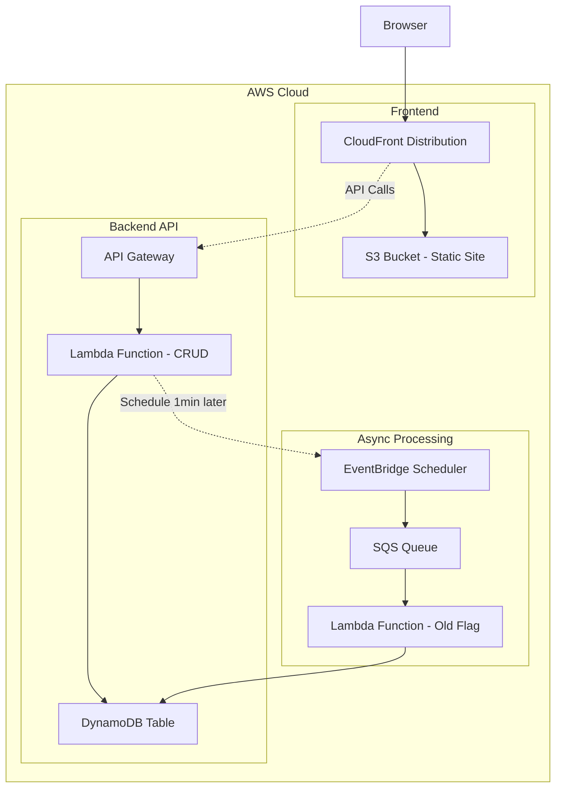

# 実装演習 非同期処理によるタスクの自動更新 (SQS + EventBridge Scheduler)

## 課題

### 要件

第3回で実装したTODO APIに、非同期処理機能を追加します。

1. タスク作成の1分後に自動的に`old`フラグを付与
1. EventBridge Schedulerによるスケジュール管理
1. SQSキューを経由したLambda関数の呼び出し
1. フロントエンドで`old`フラグの視覚的表示

### 前提条件

第3回の実装（`03.cdk-lambda`）が完了していることを前提とします。
本演習では、第3回で作成したリソースに非同期処理機能を追加します。

### 実装手順

1. 前回の環境確認と準備
1. DynamoDBテーブルに`old`フィールドの追加
1. SQSキューの作成（CDK）
1. EventBridge Schedulerロールの作成（CDK）
1. `old`フラグ付与Lambda関数の実装
1. タスク作成時のスケジュール登録処理追加
1. フロントエンドでの`old`表示対応
1. 動作確認とテスト
1. クリーンアップ

## 構成図

### システム全体の構成



タスク作成時にCRUD Lambda関数がEventBridge Schedulerで1分後のスケジュールを登録します。
1分後、EventBridge SchedulerがSQSキューにメッセージを送信し、SQSがOld Flag Lambda関数をトリガーします。
Lambda関数がDynamoDBの該当タスクに`old: true`を設定します。

## Step 1: 前回の環境確認と準備

### プロジェクト構造の確認

第3回で作成した`03.cdk-lambda`ディレクトリが存在することを確認します。

```bash
cd 03.cdk-lambda
ls -la
```

以下のディレクトリが存在することを確認：
- `infrastructure/cdk/` - CDKプロジェクト
- `backend/lambda/` - Lambda関数
- `frontend/nextjs/` - Next.jsフロントエンド

### デプロイ状態の確認

```bash
cd infrastructure/cdk

# スタックの状態を確認
aws cloudformation describe-stacks --stack-name CdkStack

# 出力値を確認
aws cloudformation describe-stacks --stack-name CdkStack --query 'Stacks[0].Outputs'
```

必要な出力値（`ApiEndpoint`, `TodoTableName`, `WebsiteURL`など）が存在することを確認します。

## Step 2: DynamoDBテーブルに`old`フィールドの追加

DynamoDBはスキーマレスなので、アイテムに新しいフィールドを追加するだけでOKです。
CDKの変更は不要ですが、Lambda関数のコードで`old`フィールドを扱えるようにします。

### Lambda関数の更新（タスク作成時に`old: false`を設定）

`backend/lambda/index.mjs` を更新して、タスク作成時に`old: false`を初期値として設定します。

```diff
     // 新規作成
     if (method === "POST" && isTodosRoot(path)) {
       const body = parseBody(event);
       if (!body) return json(400, { message: "invalid JSON" });

       const { title, dueDate = null } = body;
       if (!title || typeof title !== "string") {
         return json(400, { message: "title is required" });
       }

       const id = crypto.randomUUID();
       const now = new Date().toISOString();
       const item = {
         id,
         title,
         completed: false,
+        old: false,
         dueDate,
         createdAt: now,
         updatedAt: now
       };

       await ddb.send(new PutCommand({
         TableName: TABLE_NAME,
         Item: item
       }));

       return json(201, item);
     }
```

### デプロイ

```bash
cd infrastructure/cdk
npm run build
cdk deploy --require-approval never
```

### 動作確認

新しいタスクを作成して、`old`フィールドが`false`で保存されることを確認します。

```bash
# タスクを作成
curl -X POST https://<ApiEndpoint>/todos \
  -H "Content-Type: application/json" \
  -d '{"title": "Test Task for Old Flag"}'

# DynamoDBで確認
aws dynamodb scan --table-name <TableName> --max-items 5
```

## Step 3: SQSキューの作成（CDK）

### CDKスタックにSQSキューを追加

`infrastructure/cdk/lib/cdk-stack.ts` を更新します。

```diff
 import * as cdk from 'aws-cdk-lib';
 import * as dynamodb from 'aws-cdk-lib/aws-dynamodb';
 import * as lambda from 'aws-cdk-lib/aws-lambda';
 import * as apigateway from 'aws-cdk-lib/aws-apigateway';
 import * as s3 from 'aws-cdk-lib/aws-s3';
 import * as cloudfront from 'aws-cdk-lib/aws-cloudfront';
 import * as origins from 'aws-cdk-lib/aws-cloudfront-origins';
+import * as sqs from 'aws-cdk-lib/aws-sqs';
+import * as lambdaEventSources from 'aws-cdk-lib/aws-lambda-event-sources';
 import { Construct } from 'constructs';
 import * as path from 'path';

 export class CdkStack extends cdk.Stack {
   constructor(scope: Construct, id: string, props?: cdk.StackProps) {
     super(scope, id, props);

     // DynamoDBテーブルの作成
     const table = new dynamodb.Table(this, 'TodoTable', {
       // ... (既存のコード)
     });

     // Lambda関数の作成（CRUD）
     const todoFunction = new lambda.Function(this, 'TodoFunction', {
       // ... (既存のコード)
     });

     // Lambda関数にDynamoDBテーブルへのアクセス権限を付与
     table.grantReadWriteData(todoFunction);

     // API Gatewayの作成
     const api = new apigateway.RestApi(this, 'TodoApi', {
       // ... (既存のコード)
     });

     // ... (API Gatewayの設定)

+    // SQSキューの作成
+    const oldFlagQueue = new sqs.Queue(this, 'OldFlagQueue', {
+      visibilityTimeout: cdk.Duration.seconds(30),
+      retentionPeriod: cdk.Duration.days(1),
+    });
+
+    // Old Flag付与Lambda関数の作成
+    const oldFlagFunction = new lambda.Function(this, 'OldFlagFunction', {
+      runtime: lambda.Runtime.NODEJS_22_X,
+      handler: 'old-flag.handler',
+      code: lambda.Code.fromAsset(path.join(__dirname, '../../../backend/lambda')),
+      environment: {
+        TABLE_NAME: table.tableName
+      },
+      timeout: cdk.Duration.seconds(10)
+    });
+
+    // Old Flag Lambda関数にDynamoDBテーブルへのアクセス権限を付与
+    table.grantReadWriteData(oldFlagFunction);
+
+    // SQSキューをOld Flag Lambda関数のイベントソースに設定
+    oldFlagFunction.addEventSource(new lambdaEventSources.SqsEventSource(oldFlagQueue, {
+      batchSize: 1
+    }));

     // フロントエンド用S3バケットの作成
     const websiteBucket = new s3.Bucket(this, 'WebsiteBucket', {
       // ... (既存のコード)
     });

     // CloudFrontディストリビューションの作成
     const distribution = new cloudfront.Distribution(this, 'WebsiteDistribution', {
       // ... (既存のコード)
     });

     // 出力
+    new cdk.CfnOutput(this, 'OldFlagQueueUrl', {
+      value: oldFlagQueue.queueUrl,
+      description: 'SQS Queue URL for Old Flag Processing'
+    });
+
+    new cdk.CfnOutput(this, 'OldFlagQueueArn', {
+      value: oldFlagQueue.queueArn,
+      description: 'SQS Queue ARN for Old Flag Processing'
+    });
+
     new cdk.CfnOutput(this, 'WebsiteURL', {
       value: `https://${distribution.distributionDomainName}`,
       description: 'Website URL'
     });

     // ... (その他の出力)
   }
 }
```

### デプロイ

```bash
cd infrastructure/cdk
npm run build
cdk deploy --require-approval never
```

`OldFlagQueueUrl`と`OldFlagQueueArn`が出力されたことを確認します。

## Step 4: EventBridge Schedulerロールの作成とLambda関数への権限付与

### CDKスタックにEventBridge Scheduler用のIAMロールを追加

`infrastructure/cdk/lib/cdk-stack.ts` を更新します。

```diff
 import * as cdk from 'aws-cdk-lib';
 import * as dynamodb from 'aws-cdk-lib/aws-dynamodb';
 import * as lambda from 'aws-cdk-lib/aws-lambda';
 import * as apigateway from 'aws-cdk-lib/aws-apigateway';
 import * as s3 from 'aws-cdk-lib/aws-s3';
 import * as cloudfront from 'aws-cdk-lib/aws-cloudfront';
 import * as origins from 'aws-cdk-lib/aws-cloudfront-origins';
 import * as sqs from 'aws-cdk-lib/aws-sqs';
 import * as lambdaEventSources from 'aws-cdk-lib/aws-lambda-event-sources';
+import * as iam from 'aws-cdk-lib/aws-iam';
 import { Construct } from 'constructs';
 import * as path from 'path';

 export class CdkStack extends cdk.Stack {
   constructor(scope: Construct, id: string, props?: cdk.StackProps) {
     super(scope, id, props);

     // ... (既存のコード)

     // SQSキューの作成
     const oldFlagQueue = new sqs.Queue(this, 'OldFlagQueue', {
       visibilityTimeout: cdk.Duration.seconds(30),
       retentionPeriod: cdk.Duration.days(1),
     });

+    // EventBridge Scheduler用のIAMロールを作成
+    const schedulerRole = new iam.Role(this, 'SchedulerRole', {
+      assumedBy: new iam.ServicePrincipal('scheduler.amazonaws.com'),
+      description: 'Role for EventBridge Scheduler to send messages to SQS'
+    });
+
+    // SQSキューへのメッセージ送信権限を付与
+    oldFlagQueue.grantSendMessages(schedulerRole);
+
+    // CRUD Lambda関数にEventBridge Schedulerの操作権限を付与
+    todoFunction.addToRolePolicy(new iam.PolicyStatement({
+      effect: iam.Effect.ALLOW,
+      actions: [
+        'scheduler:CreateSchedule',
+        'scheduler:DeleteSchedule'
+      ],
+      resources: ['*']
+    }));
+
+    // CRUD Lambda関数にSchedulerロールのPassRole権限を付与
+    todoFunction.addToRolePolicy(new iam.PolicyStatement({
+      effect: iam.Effect.ALLOW,
+      actions: ['iam:PassRole'],
+      resources: [schedulerRole.roleArn]
+    }));
+
+    // CRUD Lambda関数の環境変数にSQS Queue URLとScheduler Role ARNを追加
+    todoFunction.addEnvironment('QUEUE_URL', oldFlagQueue.queueUrl);
+    todoFunction.addEnvironment('SCHEDULER_ROLE_ARN', schedulerRole.roleArn);

     // Old Flag付与Lambda関数の作成
     const oldFlagFunction = new lambda.Function(this, 'OldFlagFunction', {
       // ... (既存のコード)
     });

     // ... (残りのコード)
   }
 }
```

### デプロイ

```bash
cd infrastructure/cdk
npm run build
cdk deploy --require-approval never
```

## Step 5: `old`フラグ付与Lambda関数の実装

### Old Flag Lambda関数の作成

`backend/lambda/old-flag.mjs` を作成します。

```javascript
import { DynamoDBClient } from "@aws-sdk/client-dynamodb";
import { DynamoDBDocumentClient, UpdateCommand } from "@aws-sdk/lib-dynamodb";

const ddb = DynamoDBDocumentClient.from(new DynamoDBClient({}));
const TABLE_NAME = process.env.TABLE_NAME;

export const handler = async (event) => {
  console.log("Event:", JSON.stringify(event, null, 2));

  for (const record of event.Records) {
    try {
      // SQSメッセージからタスクIDを取得
      const message = JSON.parse(record.body);
      const taskId = message.taskId;

      console.log(`Processing taskId: ${taskId}`);

      // DynamoDBのタスクにoldフラグを設定
      await ddb.send(new UpdateCommand({
        TableName: TABLE_NAME,
        Key: { id: taskId },
        UpdateExpression: "SET #old = :true, #updatedAt = :now",
        ExpressionAttributeNames: {
          "#old": "old",
          "#updatedAt": "updatedAt"
        },
        ExpressionAttributeValues: {
          ":true": true,
          ":now": new Date().toISOString()
        },
        ConditionExpression: "attribute_exists(id)"
      }));

      console.log(`Successfully set old flag for taskId: ${taskId}`);
    } catch (err) {
      console.error("Error processing record:", err);
      // エラーが発生した場合、そのメッセージは再試行される
      throw err;
    }
  }

  return {
    statusCode: 200,
    body: JSON.stringify({ message: "Processed successfully" })
  };
};
```

### デプロイ

```bash
cd infrastructure/cdk
npm run build
cdk deploy --require-approval never
```

## Step 6: タスク作成時のスケジュール登録処理追加

### AWS SDK for JavaScript v3のSchedulerクライアントをインストール

`backend/lambda/package.json` を更新します。

```diff
 {
   "name": "todo-api-lambda",
   "version": "1.0.0",
   "type": "module",
   "dependencies": {
     "@aws-sdk/client-dynamodb": "^3.0.0",
-    "@aws-sdk/lib-dynamodb": "^3.0.0"
+    "@aws-sdk/lib-dynamodb": "^3.0.0",
+    "@aws-sdk/client-scheduler": "^3.0.0"
   }
 }
```

### Lambda関数を更新（タスク作成時にスケジュールを登録）

`backend/lambda/index.mjs` を更新します。

```diff
 import { DynamoDBClient } from "@aws-sdk/client-dynamodb";
 import { DynamoDBDocumentClient, PutCommand, GetCommand, ScanCommand, UpdateCommand, DeleteCommand } from "@aws-sdk/lib-dynamodb";
+import { SchedulerClient, CreateScheduleCommand } from "@aws-sdk/client-scheduler";

 const ddb = DynamoDBDocumentClient.from(new DynamoDBClient({}));
+const scheduler = new SchedulerClient({});
 const TABLE_NAME = process.env.TABLE_NAME;
+const QUEUE_URL = process.env.QUEUE_URL;
+const SCHEDULER_ROLE_ARN = process.env.SCHEDULER_ROLE_ARN;

 // ... (既存のユーティリティ関数)

 export const handler = async (event) => {
   const method = event.requestContext?.http?.method || event.httpMethod;
   const path = event.requestContext?.http?.path || event.rawPath || event.path;

   console.log(`${method} ${path}`);

   if (method === "OPTIONS") {
     return json(200, { ok: true });
   }

   try {
     // ... (GET, PUT, DELETE のコード)

     // 新規作成
     if (method === "POST" && isTodosRoot(path)) {
       const body = parseBody(event);
       if (!body) return json(400, { message: "invalid JSON" });

       const { title, dueDate = null } = body;
       if (!title || typeof title !== "string") {
         return json(400, { message: "title is required" });
       }

       const id = crypto.randomUUID();
       const now = new Date().toISOString();
       const item = {
         id,
         title,
         completed: false,
         old: false,
         dueDate,
         createdAt: now,
         updatedAt: now
       };

       await ddb.send(new PutCommand({
         TableName: TABLE_NAME,
         Item: item
       }));

+      // EventBridge Schedulerで1分後にスケジュールを登録
+      try {
+        const scheduleTime = new Date(Date.now() + 60 * 1000); // 1分後
+        const scheduleName = `old-flag-${id}`;
+
+        await scheduler.send(new CreateScheduleCommand({
+          Name: scheduleName,
+          ScheduleExpression: `at(${scheduleTime.toISOString().slice(0, 19)})`,
+          Target: {
+            Arn: QUEUE_URL.replace('https://sqs.', 'arn:aws:sqs:').replace('.amazonaws.com/', ':').replace(/\//g, ':'),
+            RoleArn: SCHEDULER_ROLE_ARN,
+            Input: JSON.stringify({ taskId: id })
+          },
+          FlexibleTimeWindow: {
+            Mode: 'OFF'
+          }
+        }));
+
+        console.log(`Scheduled old flag for task ${id} at ${scheduleTime.toISOString()}`);
+      } catch (scheduleErr) {
+        console.error("Failed to create schedule:", scheduleErr);
+        // スケジュール作成に失敗してもタスクは作成されているのでエラーにしない
+      }

       return json(201, item);
     }

     return json(404, { message: "route not found" });

   } catch (err) {
     console.error(err);
     const code = err.name === "ConditionalCheckFailedException" ? 404 : 500;
     return json(code, { message: err.message || "error" });
   }
 };
```

### SQS ARN変換の修正

上記のコードではQueue URLからARNへの変換を簡易的に行っていますが、より確実にするため環境変数でARNを渡す方が良いです。

`infrastructure/cdk/lib/cdk-stack.ts` を更新します。

```diff
     // CRUD Lambda関数の環境変数にSQS Queue URLとScheduler Role ARNを追加
     todoFunction.addEnvironment('QUEUE_URL', oldFlagQueue.queueUrl);
+    todoFunction.addEnvironment('QUEUE_ARN', oldFlagQueue.queueArn);
     todoFunction.addEnvironment('SCHEDULER_ROLE_ARN', schedulerRole.roleArn);
```

`backend/lambda/index.mjs` を更新します。

```diff
 const TABLE_NAME = process.env.TABLE_NAME;
 const QUEUE_URL = process.env.QUEUE_URL;
+const QUEUE_ARN = process.env.QUEUE_ARN;
 const SCHEDULER_ROLE_ARN = process.env.SCHEDULER_ROLE_ARN;

 // ... (中略)

         await scheduler.send(new CreateScheduleCommand({
           Name: scheduleName,
           ScheduleExpression: `at(${scheduleTime.toISOString().slice(0, 19)})`,
           Target: {
-            Arn: QUEUE_URL.replace('https://sqs.', 'arn:aws:sqs:').replace('.amazonaws.com/', ':').replace(/\//g, ':'),
+            Arn: QUEUE_ARN,
             RoleArn: SCHEDULER_ROLE_ARN,
             Input: JSON.stringify({ taskId: id })
           },
           FlexibleTimeWindow: {
             Mode: 'OFF'
           }
         }));
```

### デプロイ

```bash
cd infrastructure/cdk
npm run build
cdk deploy --require-approval never
```

### 動作確認

新しいタスクを作成して、1分後に`old`フラグが`true`になることを確認します。

```bash
# タスクを作成
RESPONSE=$(curl -X POST https://<ApiEndpoint>/todos \
  -H "Content-Type: application/json" \
  -d '{"title": "Test Task for Auto Old Flag"}')

echo $RESPONSE

# タスクIDを取得
TASK_ID=$(echo $RESPONSE | jq -r '.id')

# すぐに確認（oldはfalseのはず）
curl https://<ApiEndpoint>/todos/$TASK_ID

# 1分待つ
echo "Waiting 60 seconds..."
sleep 65

# 再度確認（oldがtrueになっているはず）
curl https://<ApiEndpoint>/todos/$TASK_ID
```

## Step 7: フロントエンドでの`old`表示対応

### Next.jsアプリの更新

`frontend/nextjs/app/page.tsx` を更新して、`old`フラグを持つタスクを視覚的に表示します。

```diff
 interface Todo {
   id: string;
   title: string;
   completed: boolean;
+  old?: boolean;
   dueDate?: string;
   createdAt: string;
   updatedAt: string;
 }

 // ... (既存のコード)

   return (
     <div className="min-h-screen bg-gray-100 py-8 px-4">
       <div className="max-w-2xl mx-auto">
         <div className="bg-white rounded-lg shadow-md p-6">
           <h1 className="text-3xl font-bold text-gray-800 mb-6">TODO App</h1>

           {error && (
             <div className="bg-red-100 border border-red-400 text-red-700 px-4 py-3 rounded mb-4">
               {error}
             </div>
           )}

           <div className="flex gap-2 mb-6">
             <input
               type="text"
               value={newTodo}
               onChange={(e) => setNewTodo(e.target.value)}
               onKeyPress={(e) => e.key === 'Enter' && addTodo()}
               placeholder="新しいタスクを入力..."
               className="flex-1 px-4 py-2 border border-gray-300 rounded-md focus:outline-none focus:ring-2 focus:ring-blue-500"
             />
             <button
               onClick={addTodo}
               className="px-6 py-2 bg-blue-500 text-white rounded-md hover:bg-blue-600 focus:outline-none focus:ring-2 focus:ring-blue-500"
             >
               追加
             </button>
           </div>

           {loading ? (
             <div className="text-center py-4">読み込み中...</div>
           ) : (
             <ul className="space-y-2">
               {todos.map((todo) => (
                 <li
                   key={todo.id}
-                  className="flex items-center gap-3 p-3 border-b border-gray-200 last:border-b-0"
+                  className={`flex items-center gap-3 p-3 border-b border-gray-200 last:border-b-0 ${
+                    todo.old ? 'bg-yellow-50' : ''
+                  }`}
                 >
                   <input
                     type="checkbox"
                     checked={todo.completed}
                     onChange={(e) => toggleTodo(todo.id, e.target.checked)}
                     className="w-5 h-5 cursor-pointer"
                   />
                   <span
                     className={`flex-1 ${
                       todo.completed ? 'line-through text-gray-400' : 'text-gray-700'
                     }`}
                   >
                     {todo.title}
+                    {todo.old && (
+                      <span className="ml-2 text-xs bg-yellow-200 text-yellow-800 px-2 py-1 rounded">
+                        OLD
+                      </span>
+                    )}
                   </span>
                   <button
                     onClick={() => deleteTodo(todo.id)}
                     className="px-4 py-1 bg-red-500 text-white rounded hover:bg-red-600 focus:outline-none focus:ring-2 focus:ring-red-500"
                   >
                     削除
                   </button>
                 </li>
               ))}
             </ul>
           )}
         </div>
       </div>
     </div>
   );
 }
```

### 静的ビルドとS3デプロイ

```bash
cd frontend/nextjs

# 環境変数の確認
cat .env.local

# ビルド
npm run build

# S3にデプロイ
aws s3 sync out/ s3://<WebsiteBucketName>/ --delete

# CloudFrontのキャッシュをクリア
aws cloudfront create-invalidation \
  --distribution-id <DistributionId> \
  --paths "/*"
```

## Step 8: 動作確認とテスト

### 総合テスト

1. **タスク作成**
   ```bash
   curl -X POST https://<ApiEndpoint>/todos \
     -H "Content-Type: application/json" \
     -d '{"title": "Test Auto Old Flag"}'
   ```

2. **EventBridge Schedulerの確認**
   ```bash
   aws scheduler list-schedules --name-prefix old-flag
   ```

3. **1分待機**
   ```bash
   sleep 65
   ```

4. **SQSキューの確認**（メッセージが処理されているはず）
   ```bash
   aws sqs get-queue-attributes \
     --queue-url <OldFlagQueueUrl> \
     --attribute-names ApproximateNumberOfMessages
   ```

5. **DynamoDBで確認**
   ```bash
   aws dynamodb scan --table-name <TableName> --max-items 5
   ```

6. **CloudWatchログの確認**
   ```bash
   # Old Flag Lambda関数のログを確認
   aws logs tail /aws/lambda/<OldFlagFunctionName> --follow
   ```

### フロントエンドでの確認

1. ブラウザで`WebsiteURL`にアクセス
2. 新しいタスクを複数作成
3. 1分待つ
4. ページをリロードして、タスクに"OLD"バッジが表示されることを確認

## Step 9: クリーンアップ

### リソースの削除

不要になったリソースを削除します。

```bash
cd infrastructure/cdk
cdk destroy --force
```

このコマンドで以下のリソースが削除されます：
- DynamoDBテーブル
- Lambda関数（CRUD + Old Flag）
- API Gateway
- SQSキュー
- EventBridge Schedulerのスケジュール
- IAMロール
- S3バケット（フロントエンド）
- CloudFrontディストリビューション
