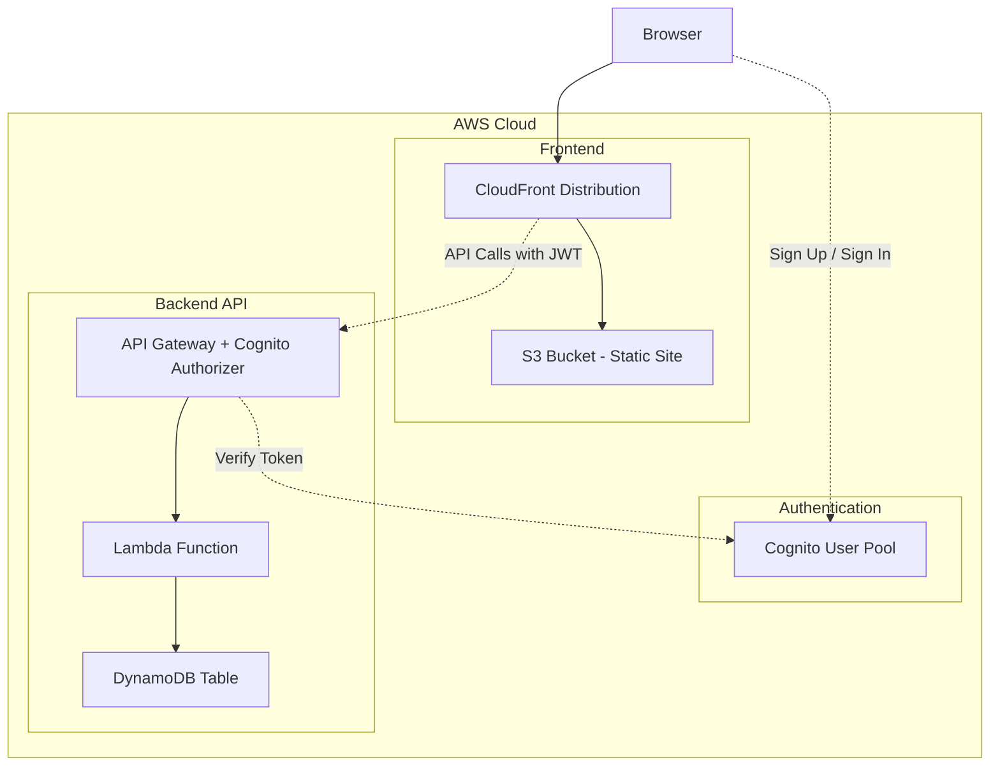

# 実装演習 Cognito認証機能の追加 (AWS Cognito + Lambda + Next.js)

## 課題

### 要件

1. Cognito User Poolを使ったユーザー認証機能
1. サインアップ、ログイン、ログアウト機能の実装
1. メールアドレス検証機能
1. 認証が必要なAPIエンドポイントの作成
1. Next.jsフロントエンドでのAWS Amplify UI統合

### 実装手順

段階的に実装を進めます。各ステップで動作確認を行い、問題があれば次に進む前に解決します。

1. CDKプロジェクトの初期化とCognito User Poolの作成
1. 保護されたAPI用のLambda関数実装
1. API GatewayにCognito Authorizerを追加
1. ユーザー情報取得APIの実装
1. Next.jsフロントエンドの実装（Amplify UI）
1. 動作確認とテスト
1. クリーンアップ

## 構成図

### システム全体の構成



ユーザーはブラウザでサインアップ・ログインを行い、Cognito User PoolからJWTトークンを取得します。
APIへのリクエストではJWTトークンをAuthorizationヘッダーに含めます。
API GatewayのCognito AuthorizerがトークンをCognito User Poolで検証し、認証されたリクエストのみLambda関数に転送されます。

## Step 1: CDKプロジェクトの初期化とCognito User Poolの作成

### 前提条件

- Node.js 22以上がインストールされていること
- AWS CLIがインストールされ、認証情報が設定されていること
- AWS CDKがグローバルにインストールされていること

```bash
# Node.jsのバージョン確認
node --version

# AWS CLIの確認
aws --version

# AWS CDKのインストール（未インストールの場合）
npm install -g aws-cdk

# AWS CDKのバージョン確認
cdk --version
```

### プロジェクト構造の作成

```bash
cd 05.cdk-lambda-cognito
mkdir -p infrastructure/cdk
mkdir -p backend/lambda
mkdir -p frontend
```

最終的なディレクトリ構成：

```
05.cdk-lambda-cognito/
├── README.md
├── infrastructure/
│   └── cdk/
│       ├── bin/
│       │   └── cdk.ts
│       ├── lib/
│       │   └── cdk-stack.ts
│       ├── cdk.json
│       ├── package.json
│       └── tsconfig.json
├── backend/
│   └── lambda/
│       ├── index.mjs
│       └── package.json
└── frontend/
    └── nextjs/
        └── (Next.jsプロジェクト)
```

### CDKプロジェクトの初期化

```bash
cd infrastructure/cdk
cdk init app --language typescript
npm install
```

### CDKのブートストラップ

初回のみ必要です（既に他のプロジェクトで実行済みの場合はスキップ可能）。

```bash
cdk bootstrap
```

### Cognito User Poolの作成

`infrastructure/cdk/lib/cdk-stack.ts` を編集します。

```typescript
import * as cdk from 'aws-cdk-lib';
import * as cognito from 'aws-cdk-lib/aws-cognito';
import { Construct } from 'constructs';

export class CdkStack extends cdk.Stack {
  constructor(scope: Construct, id: string, props?: cdk.StackProps) {
    super(scope, id, props);

    // Cognito User Poolの作成
    const userPool = new cognito.UserPool(this, 'UserPool', {
      userPoolName: 'auth-demo-user-pool',
      selfSignUpEnabled: true, // ユーザー自身でサインアップ可能
      signInAliases: {
        email: true // メールアドレスでログイン
      },
      autoVerify: {
        email: true // メール検証を自動で行う
      },
      passwordPolicy: {
        minLength: 8,
        requireLowercase: true,
        requireUppercase: true,
        requireDigits: true,
        requireSymbols: false
      },
      accountRecovery: cognito.AccountRecovery.EMAIL_ONLY,
      removalPolicy: cdk.RemovalPolicy.DESTROY // 開発環境用：スタック削除時にUser Poolも削除
    });

    // User Pool Clientの作成
    const userPoolClient = userPool.addClient('UserPoolClient', {
      authFlows: {
        userPassword: true, // ユーザー名とパスワードでの認証
        userSrp: true // SRP（Secure Remote Password）プロトコル
      }
    });

    // 出力
    new cdk.CfnOutput(this, 'UserPoolId', {
      value: userPool.userPoolId,
      description: 'Cognito User Pool ID'
    });

    new cdk.CfnOutput(this, 'UserPoolClientId', {
      value: userPoolClient.userPoolClientId,
      description: 'Cognito User Pool Client ID'
    });

    new cdk.CfnOutput(this, 'Region', {
      value: this.region,
      description: 'AWS Region'
    });
  }
}
```

### スタック名の設定

`infrastructure/cdk/bin/cdk.ts` を編集します。

```typescript
#!/usr/bin/env node
import 'source-map-support/register';
import * as cdk from 'aws-cdk-lib';
import { CdkStack } from '../lib/cdk-stack';

const app = new cdk.App();
new CdkStack(app, 'CognitoAuthStack', {
  stackName: 'CognitoAuthStack', // 衝突しない名前を設定してください
});
```

### デプロイ

```bash
cd infrastructure/cdk
npm run build
cdk deploy --require-approval never
```

### 動作確認

AWS Management Consoleで以下を確認：
1. CloudFormationスタックが正常に作成されていること
1. Cognito User Poolが作成されていること

またはCLIで確認：

```bash
aws cognito-idp list-user-pools --max-results 10
```

出力された`UserPoolId`、`UserPoolClientId`、`Region`をメモしておきます。

## Step 2: 保護されたAPI用のLambda関数実装

### DynamoDBテーブルの追加

`infrastructure/cdk/lib/cdk-stack.ts` を更新します。

```diff
 import * as cdk from 'aws-cdk-lib';
 import * as cognito from 'aws-cdk-lib/aws-cognito';
+import * as dynamodb from 'aws-cdk-lib/aws-dynamodb';
+import * as lambda from 'aws-cdk-lib/aws-lambda';
 import { Construct } from 'constructs';
+import * as path from 'path';

 export class CdkStack extends cdk.Stack {
   constructor(scope: Construct, id: string, props?: cdk.StackProps) {
     super(scope, id, props);

     // Cognito User Poolの作成
     const userPool = new cognito.UserPool(this, 'UserPool', {
       // ... (既存のコード)
     });

     // User Pool Clientの作成
     const userPoolClient = userPool.addClient('UserPoolClient', {
       // ... (既存のコード)
     });

+    // DynamoDBテーブルの作成（ユーザープロフィール用）
+    const table = new dynamodb.Table(this, 'UserProfileTable', {
+      partitionKey: {
+        name: 'userId',
+        type: dynamodb.AttributeType.STRING
+      },
+      billingMode: dynamodb.BillingMode.PAY_PER_REQUEST,
+      removalPolicy: cdk.RemovalPolicy.DESTROY,
+    });
+
+    // Lambda関数の作成
+    const apiFunction = new lambda.Function(this, 'ApiFunction', {
+      runtime: lambda.Runtime.NODEJS_22_X,
+      handler: 'index.handler',
+      code: lambda.Code.fromAsset(path.join(__dirname, '../../../backend/lambda')),
+      environment: {
+        TABLE_NAME: table.tableName,
+        USER_POOL_ID: userPool.userPoolId
+      },
+      timeout: cdk.Duration.seconds(10)
+    });
+
+    // Lambda関数にDynamoDBテーブルへのアクセス権限を付与
+    table.grantReadWriteData(apiFunction);

     // 出力
     new cdk.CfnOutput(this, 'UserPoolId', {
       value: userPool.userPoolId,
       description: 'Cognito User Pool ID'
     });

     new cdk.CfnOutput(this, 'UserPoolClientId', {
       value: userPoolClient.userPoolClientId,
       description: 'Cognito User Pool Client ID'
     });

     new cdk.CfnOutput(this, 'Region', {
       value: this.region,
       description: 'AWS Region'
     });
+
+    new cdk.CfnOutput(this, 'TableName', {
+      value: table.tableName,
+      description: 'DynamoDB Table Name'
+    });
   }
 }
```

### Lambda関数の実装

`backend/lambda/package.json` を作成します。

```json
{
  "name": "cognito-auth-api",
  "version": "1.0.0",
  "type": "module",
  "dependencies": {
    "@aws-sdk/client-dynamodb": "^3.0.0",
    "@aws-sdk/lib-dynamodb": "^3.0.0"
  }
}
```

`backend/lambda/index.mjs` を作成します。

```javascript
import { DynamoDBClient } from "@aws-sdk/client-dynamodb";
import { DynamoDBDocumentClient, GetCommand, PutCommand } from "@aws-sdk/lib-dynamodb";

const ddb = DynamoDBDocumentClient.from(new DynamoDBClient({}));
const TABLE_NAME = process.env.TABLE_NAME;

// JSONレスポンスを返すためのユーティリティ
const json = (statusCode, body = {}) => ({
  statusCode,
  headers: {
    "Content-Type": "application/json",
    "Access-Control-Allow-Origin": "*",
    "Access-Control-Allow-Headers": "Content-Type,Authorization",
    "Access-Control-Allow-Methods": "GET,POST,PUT,DELETE,OPTIONS"
  },
  body: JSON.stringify(body)
});

// リクエストボディをパースするユーティリティ
const parseBody = (event) => {
  try {
    return event.body ? JSON.parse(event.body) : {};
  } catch {
    return null;
  }
};

export const handler = async (event) => {
  const method = event.requestContext?.http?.method || event.httpMethod;
  const path = event.requestContext?.http?.path || event.rawPath || event.path;

  console.log(`${method} ${path}`);
  console.log("Event:", JSON.stringify(event, null, 2));

  // OPTIONSはCORS対応のために常に200を返す
  if (method === "OPTIONS") {
    return json(200, { ok: true });
  }

  // Cognito AuthorizerからユーザーIDを取得
  const userId = event.requestContext?.authorizer?.jwt?.claims?.sub ||
                 event.requestContext?.authorizer?.claims?.sub;

  if (!userId) {
    return json(401, { message: "Unauthorized" });
  }

  try {
    // ユーザープロフィール取得
    if (method === "GET" && path === "/profile") {
      const res = await ddb.send(new GetCommand({
        TableName: TABLE_NAME,
        Key: { userId }
      }));

      // プロフィールが存在しない場合は初期データを返す
      if (!res.Item) {
        return json(200, {
          userId,
          profile: null,
          message: "Profile not found. Please create one."
        });
      }

      return json(200, res.Item);
    }

    // ユーザープロフィール作成・更新
    if (method === "POST" && path === "/profile") {
      const body = parseBody(event);
      if (!body) return json(400, { message: "invalid JSON" });

      const { displayName, bio } = body;

      const now = new Date().toISOString();
      const item = {
        userId,
        displayName: displayName || "",
        bio: bio || "",
        createdAt: res.Item?.createdAt || now,
        updatedAt: now
      };

      await ddb.send(new PutCommand({
        TableName: TABLE_NAME,
        Item: item
      }));

      return json(200, item);
    }

    // 認証されたユーザー情報を返す（テスト用）
    if (method === "GET" && path === "/me") {
      const claims = event.requestContext?.authorizer?.jwt?.claims ||
                     event.requestContext?.authorizer?.claims;

      return json(200, {
        userId,
        email: claims.email,
        emailVerified: claims.email_verified,
        message: "You are authenticated!"
      });
    }

    return json(404, { message: "route not found" });

  } catch (err) {
    console.error(err);
    return json(500, { message: err.message || "error" });
  }
};
```

### デプロイ

```bash
cd infrastructure/cdk
npm run build
cdk deploy --require-approval never
```

## Step 3: API GatewayにCognito Authorizerを追加

### API Gatewayの追加

`infrastructure/cdk/lib/cdk-stack.ts` を更新します。

```diff
 import * as cdk from 'aws-cdk-lib';
 import * as cognito from 'aws-cdk-lib/aws-cognito';
 import * as dynamodb from 'aws-cdk-lib/aws-dynamodb';
 import * as lambda from 'aws-cdk-lib/aws-lambda';
+import * as apigateway from 'aws-cdk-lib/aws-apigatewayv2';
+import * as integrations from 'aws-cdk-lib/aws-apigatewayv2-integrations';
+import * as authorizers from 'aws-cdk-lib/aws-apigatewayv2-authorizers';
 import { Construct } from 'constructs';
 import * as path from 'path';

 export class CdkStack extends cdk.Stack {
   constructor(scope: Construct, id: string, props?: cdk.StackProps) {
     super(scope, id, props);

     // ... (Cognito User Pool, DynamoDB, Lambda のコード)

     // Lambda関数にDynamoDBテーブルへのアクセス権限を付与
     table.grantReadWriteData(apiFunction);

+    // HTTP API Gatewayの作成
+    const httpApi = new apigateway.HttpApi(this, 'HttpApi', {
+      apiName: 'cognito-auth-api',
+      corsPreflight: {
+        allowOrigins: ['*'],
+        allowMethods: [
+          apigateway.CorsHttpMethod.GET,
+          apigateway.CorsHttpMethod.POST,
+          apigateway.CorsHttpMethod.PUT,
+          apigateway.CorsHttpMethod.DELETE,
+          apigateway.CorsHttpMethod.OPTIONS
+        ],
+        allowHeaders: ['Content-Type', 'Authorization']
+      }
+    });
+
+    // Cognito Authorizerの作成
+    const cognitoAuthorizer = new authorizers.HttpUserPoolAuthorizer(
+      'CognitoAuthorizer',
+      userPool,
+      {
+        userPoolClients: [userPoolClient]
+      }
+    );
+
+    // Lambda統合の作成
+    const lambdaIntegration = new integrations.HttpLambdaIntegration(
+      'LambdaIntegration',
+      apiFunction
+    );
+
+    // ルートの追加（認証が必要なエンドポイント）
+    httpApi.addRoutes({
+      path: '/me',
+      methods: [apigateway.HttpMethod.GET],
+      integration: lambdaIntegration,
+      authorizer: cognitoAuthorizer
+    });
+
+    httpApi.addRoutes({
+      path: '/profile',
+      methods: [apigateway.HttpMethod.GET, apigateway.HttpMethod.POST],
+      integration: lambdaIntegration,
+      authorizer: cognitoAuthorizer
+    });

     // 出力
     new cdk.CfnOutput(this, 'UserPoolId', {
       value: userPool.userPoolId,
       description: 'Cognito User Pool ID'
     });

     new cdk.CfnOutput(this, 'UserPoolClientId', {
       value: userPoolClient.userPoolClientId,
       description: 'Cognito User Pool Client ID'
     });

     new cdk.CfnOutput(this, 'Region', {
       value: this.region,
       description: 'AWS Region'
     });

     new cdk.CfnOutput(this, 'TableName', {
       value: table.tableName,
       description: 'DynamoDB Table Name'
     });
+
+    new cdk.CfnOutput(this, 'ApiEndpoint', {
+      value: httpApi.url || '',
+      description: 'HTTP API Gateway Endpoint'
+    });
   }
 }
```

### デプロイ

```bash
cd infrastructure/cdk
npm run build
cdk deploy --require-approval never
```

出力された`ApiEndpoint`をメモしておきます。

### 動作確認（認証なしでアクセス）

```bash
# 認証なしでアクセス（401 Unauthorizedが返ってくるはず）
curl https://<ApiEndpoint>/me
```

`{"message":"Unauthorized"}` が返ってくればCognito Authorizerが正しく動作しています。

## Step 4: ユーザー情報取得APIの実装

前のステップで既に実装済みです。以下の3つのエンドポイントが利用可能です：

1. `GET /me` - 認証されたユーザーの基本情報を取得
2. `GET /profile` - ユーザープロフィールを取得
3. `POST /profile` - ユーザープロフィールを作成・更新

## Step 5: Next.jsフロントエンドの実装（Amplify UI）

### Next.jsプロジェクトの作成

```bash
cd frontend
npx create-next-app@latest nextjs --typescript --tailwind --app --no-src-dir --import-alias "@/*"
cd nextjs
```

インタラクティブな質問には以下のように回答します：
- Would you like to use TypeScript? Yes
- Would you like to use ESLint? Yes
- Would you like to use Tailwind CSS? Yes
- Would you like to use `src/` directory? No
- Would you like to use App Router? Yes
- Would you like to customize the default import alias? No

### 必要なパッケージのインストール

```bash
npm install aws-amplify @aws-amplify/ui-react
```

### 静的エクスポートの設定

`frontend/nextjs/next.config.ts` を編集します。

```typescript
import type { NextConfig } from "next";

const nextConfig: NextConfig = {
  output: 'export',
  images: {
    unoptimized: true
  }
};

export default nextConfig;
```

### 環境変数の設定

`frontend/nextjs/.env.local` を作成します。

```bash
NEXT_PUBLIC_USER_POOL_ID=<UserPoolId>
NEXT_PUBLIC_USER_POOL_CLIENT_ID=<UserPoolClientId>
NEXT_PUBLIC_REGION=<Region>
NEXT_PUBLIC_API_ENDPOINT=<ApiEndpoint>
```

実際の値に置き換えてください。

### Amplify設定ファイルの作成

`frontend/nextjs/lib/amplify-config.ts` を作成します。

```typescript
export const amplifyConfig = {
  Auth: {
    Cognito: {
      userPoolId: process.env.NEXT_PUBLIC_USER_POOL_ID || '',
      userPoolClientId: process.env.NEXT_PUBLIC_USER_POOL_CLIENT_ID || '',
      signUpVerificationMethod: 'code' as const,
      loginWith: {
        email: true
      }
    }
  }
};
```

### 認証プロバイダーの作成

`frontend/nextjs/components/AuthProvider.tsx` を作成します。

```typescript
'use client';

import { Amplify } from 'aws-amplify';
import { amplifyConfig } from '@/lib/amplify-config';
import { useEffect } from 'react';

Amplify.configure(amplifyConfig, { ssr: false });

export default function AuthProvider({
  children,
}: {
  children: React.ReactNode;
}) {
  useEffect(() => {
    // クライアントサイドでのみAmplifyを初期化
    Amplify.configure(amplifyConfig, { ssr: false });
  }, []);

  return <>{children}</>;
}
```

### レイアウトの更新

`frontend/nextjs/app/layout.tsx` を編集します。

```typescript
import type { Metadata } from "next";
import { Inter } from "next/font/google";
import "./globals.css";
import AuthProvider from "@/components/AuthProvider";

const inter = Inter({ subsets: ["latin"] });

export const metadata: Metadata = {
  title: "Cognito Auth Demo",
  description: "AWS Cognito authentication demo with Next.js",
};

export default function RootLayout({
  children,
}: Readonly<{
  children: React.ReactNode;
}>) {
  return (
    <html lang="ja">
      <body className={inter.className}>
        <AuthProvider>
          {children}
        </AuthProvider>
      </body>
    </html>
  );
}
```

### メインページの実装

`frontend/nextjs/app/page.tsx` を編集します。

```typescript
'use client';

import { useState, useEffect } from 'react';
import { Authenticator } from '@aws-amplify/ui-react';
import '@aws-amplify/ui-react/styles.css';
import { fetchAuthSession, signOut } from 'aws-amplify/auth';

interface UserProfile {
  userId: string;
  displayName?: string;
  bio?: string;
  createdAt?: string;
  updatedAt?: string;
}

export default function Home() {
  const [userInfo, setUserInfo] = useState<any>(null);
  const [profile, setProfile] = useState<UserProfile | null>(null);
  const [displayName, setDisplayName] = useState('');
  const [bio, setBio] = useState('');
  const [error, setError] = useState('');
  const [loading, setLoading] = useState(false);

  const API_ENDPOINT = process.env.NEXT_PUBLIC_API_ENDPOINT || '';

  // 認証済みユーザー情報を取得
  const fetchUserInfo = async () => {
    try {
      setLoading(true);
      const session = await fetchAuthSession();
      const token = session.tokens?.idToken?.toString();

      if (!token) {
        throw new Error('No token found');
      }

      const response = await fetch(`${API_ENDPOINT}/me`, {
        headers: {
          'Authorization': `Bearer ${token}`
        }
      });

      if (!response.ok) throw new Error('Failed to fetch user info');

      const data = await response.json();
      setUserInfo(data);
      setError('');
    } catch (err) {
      console.error('Error:', err);
      setError('ユーザー情報の取得に失敗しました');
    } finally {
      setLoading(false);
    }
  };

  // プロフィール取得
  const fetchProfile = async () => {
    try {
      setLoading(true);
      const session = await fetchAuthSession();
      const token = session.tokens?.idToken?.toString();

      if (!token) {
        throw new Error('No token found');
      }

      const response = await fetch(`${API_ENDPOINT}/profile`, {
        headers: {
          'Authorization': `Bearer ${token}`
        }
      });

      if (!response.ok) throw new Error('Failed to fetch profile');

      const data = await response.json();
      setProfile(data);
      if (data.displayName) setDisplayName(data.displayName);
      if (data.bio) setBio(data.bio);
      setError('');
    } catch (err) {
      console.error('Error:', err);
      setError('プロフィールの取得に失敗しました');
    } finally {
      setLoading(false);
    }
  };

  // プロフィール保存
  const saveProfile = async () => {
    try {
      setLoading(true);
      const session = await fetchAuthSession();
      const token = session.tokens?.idToken?.toString();

      if (!token) {
        throw new Error('No token found');
      }

      const response = await fetch(`${API_ENDPOINT}/profile`, {
        method: 'POST',
        headers: {
          'Content-Type': 'application/json',
          'Authorization': `Bearer ${token}`
        },
        body: JSON.stringify({ displayName, bio })
      });

      if (!response.ok) throw new Error('Failed to save profile');

      const data = await response.json();
      setProfile(data);
      setError('');
      alert('プロフィールを保存しました');
    } catch (err) {
      console.error('Error:', err);
      setError('プロフィールの保存に失敗しました');
    } finally {
      setLoading(false);
    }
  };

  return (
    <Authenticator>
      {({ user }) => (
        <div className="min-h-screen bg-gray-100 py-8 px-4">
          <div className="max-w-2xl mx-auto">
            <div className="bg-white rounded-lg shadow-md p-6">
              <div className="flex justify-between items-center mb-6">
                <h1 className="text-3xl font-bold text-gray-800">
                  Cognito Auth Demo
                </h1>
                <button
                  onClick={() => signOut()}
                  className="px-4 py-2 bg-red-500 text-white rounded-md hover:bg-red-600"
                >
                  ログアウト
                </button>
              </div>

              {error && (
                <div className="bg-red-100 border border-red-400 text-red-700 px-4 py-3 rounded mb-4">
                  {error}
                </div>
              )}

              <div className="mb-6 p-4 bg-green-50 rounded-lg">
                <h2 className="text-xl font-semibold mb-2">ようこそ！</h2>
                <p className="text-gray-700">
                  メールアドレス: <span className="font-mono">{user.signInDetails?.loginId}</span>
                </p>
                <p className="text-gray-700">
                  ユーザーID: <span className="font-mono text-sm">{user.userId}</span>
                </p>
              </div>

              <div className="mb-4">
                <button
                  onClick={fetchUserInfo}
                  disabled={loading}
                  className="w-full px-4 py-2 bg-blue-500 text-white rounded-md hover:bg-blue-600 disabled:bg-gray-400"
                >
                  {loading ? '読み込み中...' : 'ユーザー情報を取得（API呼び出し）'}
                </button>
              </div>

              {userInfo && (
                <div className="mb-6 p-4 bg-blue-50 rounded-lg">
                  <h3 className="text-lg font-semibold mb-2">API レスポンス</h3>
                  <pre className="text-sm overflow-auto">
                    {JSON.stringify(userInfo, null, 2)}
                  </pre>
                </div>
              )}

              <hr className="my-6" />

              <h2 className="text-2xl font-bold mb-4">プロフィール</h2>

              <div className="mb-4">
                <button
                  onClick={fetchProfile}
                  disabled={loading}
                  className="w-full px-4 py-2 bg-green-500 text-white rounded-md hover:bg-green-600 disabled:bg-gray-400"
                >
                  {loading ? '読み込み中...' : 'プロフィールを取得'}
                </button>
              </div>

              <div className="space-y-4">
                <div>
                  <label className="block text-sm font-medium text-gray-700 mb-1">
                    表示名
                  </label>
                  <input
                    type="text"
                    value={displayName}
                    onChange={(e) => setDisplayName(e.target.value)}
                    className="w-full px-4 py-2 border border-gray-300 rounded-md focus:outline-none focus:ring-2 focus:ring-blue-500"
                    placeholder="山田太郎"
                  />
                </div>

                <div>
                  <label className="block text-sm font-medium text-gray-700 mb-1">
                    自己紹介
                  </label>
                  <textarea
                    value={bio}
                    onChange={(e) => setBio(e.target.value)}
                    rows={4}
                    className="w-full px-4 py-2 border border-gray-300 rounded-md focus:outline-none focus:ring-2 focus:ring-blue-500"
                    placeholder="簡単な自己紹介を入力してください"
                  />
                </div>

                <button
                  onClick={saveProfile}
                  disabled={loading}
                  className="w-full px-4 py-2 bg-purple-500 text-white rounded-md hover:bg-purple-600 disabled:bg-gray-400"
                >
                  {loading ? '保存中...' : 'プロフィールを保存'}
                </button>
              </div>

              {profile && (
                <div className="mt-6 p-4 bg-purple-50 rounded-lg">
                  <h3 className="text-lg font-semibold mb-2">保存されたプロフィール</h3>
                  <pre className="text-sm overflow-auto">
                    {JSON.stringify(profile, null, 2)}
                  </pre>
                </div>
              )}
            </div>
          </div>
        </div>
      )}
    </Authenticator>
  );
}
```

### ローカルで動作確認

```bash
npm run dev
```

ブラウザで`http://localhost:3000`にアクセスして動作確認します。

## Step 6: 動作確認とテスト

### サインアップとログイン

1. ローカル開発サーバーを起動（`npm run dev`）
2. ブラウザで`http://localhost:3000`にアクセス
3. 「Create Account」タブをクリック
4. メールアドレスとパスワードを入力してサインアップ
5. 登録したメールアドレスに検証コードが届く
6. 検証コードを入力して確認
7. ログインが完了し、メインページが表示される

### API呼び出しのテスト

1. 「ユーザー情報を取得」ボタンをクリック
2. APIレスポンスが表示されることを確認
3. 「プロフィールを取得」ボタンをクリック
4. プロフィール情報を入力
5. 「プロフィールを保存」ボタンをクリック
6. 保存されたプロフィールが表示されることを確認
7. 再度「プロフィールを取得」ボタンをクリックして、データが永続化されていることを確認

### CloudFrontにデプロイ

#### S3バケットとCloudFrontの追加

`infrastructure/cdk/lib/cdk-stack.ts` を更新します。

```diff
 import * as cdk from 'aws-cdk-lib';
 import * as cognito from 'aws-cdk-lib/aws-cognito';
 import * as dynamodb from 'aws-cdk-lib/aws-dynamodb';
 import * as lambda from 'aws-cdk-lib/aws-lambda';
 import * as apigateway from 'aws-cdk-lib/aws-apigatewayv2';
 import * as integrations from 'aws-cdk-lib/aws-apigatewayv2-integrations';
 import * as authorizers from 'aws-cdk-lib/aws-apigatewayv2-authorizers';
+import * as s3 from 'aws-cdk-lib/aws-s3';
+import * as cloudfront from 'aws-cdk-lib/aws-cloudfront';
+import * as origins from 'aws-cdk-lib/aws-cloudfront-origins';
 import { Construct } from 'constructs';
 import * as path from 'path';

 export class CdkStack extends cdk.Stack {
   constructor(scope: Construct, id: string, props?: cdk.StackProps) {
     super(scope, id, props);

     // ... (既存のコード)

+    // フロントエンド用S3バケットの作成
+    const websiteBucket = new s3.Bucket(this, 'WebsiteBucket', {
+      removalPolicy: cdk.RemovalPolicy.DESTROY,
+      autoDeleteObjects: true,
+      publicReadAccess: false,
+      blockPublicAccess: s3.BlockPublicAccess.BLOCK_ALL
+    });
+
+    // CloudFrontディストリビューションの作成
+    const distribution = new cloudfront.Distribution(this, 'WebsiteDistribution', {
+      defaultBehavior: {
+        origin: new origins.S3Origin(websiteBucket),
+        viewerProtocolPolicy: cloudfront.ViewerProtocolPolicy.REDIRECT_TO_HTTPS
+      },
+      defaultRootObject: 'index.html',
+      errorResponses: [
+        {
+          httpStatus: 404,
+          responseHttpStatus: 200,
+          responsePagePath: '/index.html'
+        }
+      ]
+    });

     // 出力
     new cdk.CfnOutput(this, 'UserPoolId', {
       value: userPool.userPoolId,
       description: 'Cognito User Pool ID'
     });

     new cdk.CfnOutput(this, 'UserPoolClientId', {
       value: userPoolClient.userPoolClientId,
       description: 'Cognito User Pool Client ID'
     });

     new cdk.CfnOutput(this, 'Region', {
       value: this.region,
       description: 'AWS Region'
     });

     new cdk.CfnOutput(this, 'TableName', {
       value: table.tableName,
       description: 'DynamoDB Table Name'
     });

     new cdk.CfnOutput(this, 'ApiEndpoint', {
       value: httpApi.url || '',
       description: 'HTTP API Gateway Endpoint'
     });
+
+    new cdk.CfnOutput(this, 'WebsiteURL', {
+      value: `https://${distribution.distributionDomainName}`,
+      description: 'Website URL'
+    });
+
+    new cdk.CfnOutput(this, 'WebsiteBucketName', {
+      value: websiteBucket.bucketName,
+      description: 'S3 Bucket Name for Website'
+    });
   }
 }
```

#### デプロイ

```bash
cd infrastructure/cdk
npm run build
cdk deploy --require-approval never
```

#### Next.jsのビルドとアップロード

```bash
cd frontend/nextjs

# 環境変数の確認
cat .env.local

# ビルド
npm run build

# S3にアップロード
aws s3 sync out/ s3://<WebsiteBucketName>/ --delete

# CloudFrontのキャッシュをクリア
aws cloudfront create-invalidation \
  --distribution-id <DistributionId> \
  --paths "/*"
```

DistributionIdはAWS Management ConsoleのCloudFrontページで確認できます。

#### 本番環境での動作確認

ブラウザで`WebsiteURL`にアクセスして、サインアップ・ログイン・API呼び出しが正常に動作することを確認します。

## Step 7: クリーンアップ

### リソースの削除

不要になったリソースを削除します。

```bash
cd infrastructure/cdk
cdk destroy --force
```

このコマンドで以下のリソースが削除されます：
- Cognito User Pool
- DynamoDBテーブル
- Lambda関数
- API Gateway
- S3バケット（フロントエンド）
- CloudFrontディストリビューション
