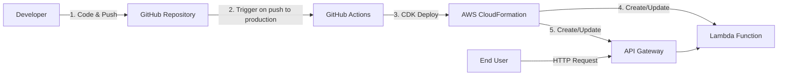
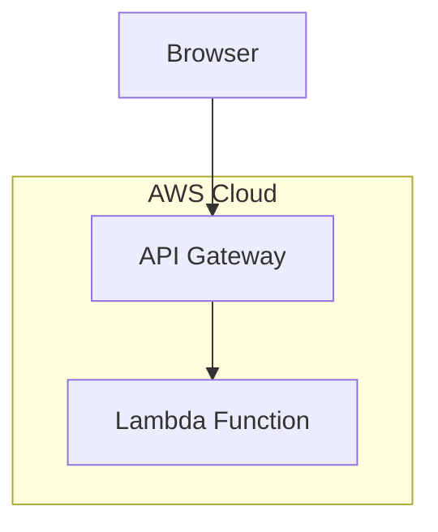

# 実装演習 GitHub ActionsによるCDKアプリケーションの自動デプロイ

## 課題

### やりたいこと
GitHub の特定のブランチにコードをpushしたら、  
自動で AWS CDK アプリケーションがデプロイされる仕組みを作る。

### 要件

1. Lambda + API Gatewayのシンプルなアプリケーション
1. AWS CDKによるInfrastructure as Code実装
1. GitHub Actionsによる自動デプロイ
1. productionブランチへのpushで自動デプロイ

### 実装手順

1. CDKプロジェクトの初期化とアプリケーション作成
1. ローカル環境でのデプロイ確認
1. GitHubリポジトリのセットアップ
1. AWS認証情報の設定（GitHub Secrets）
1. GitHub Actionsワークフローの作成
1. 自動デプロイの動作確認
1. クリーンアップ

## 構成図

### CI/CDフロー



### システム構成



## Step 1: 前提条件とプロジェクト構造

### 前提条件

- Node.js 22以上がインストールされていること
- AWS CLIがインストールされ、認証情報が設定されていること
- AWS CDKがグローバルにインストールされていること
- Gitがインストールされていること
- GitHubアカウントがあること

```bash
# バージョン確認
node --version
aws --version
cdk --version
git --version
```

### プロジェクト構造

```
06.github-actions-cicd/
├── README.md
├── .gitignore
├── infrastructure/
│   └── cdk/
│       ├── bin/
│       │   └── cdk.ts
│       ├── lib/
│       │   └── cdk-stack.ts
│       ├── cdk.json
│       ├── package.json
│       └── tsconfig.json
├── backend/
│   └── lambda/
│       ├── index.mjs
│       └── package.json
└── .github/
    └── workflows/
        └── deploy.yml
```

## Step 2: CDKアプリケーションの作成

### 2-1. プロジェクトディレクトリの作成

```bash
mkdir 06.github-actions-cicd
cd 06.github-actions-cicd
mkdir -p infrastructure/cdk
mkdir -p backend/lambda
mkdir -p .github/workflows
```

### 2-2. Lambda関数の実装

```javascript
// backend/lambda/index.mjs

export const handler = async (event) => {
  console.log("Event:", JSON.stringify(event, null, 2));

  return {
    statusCode: 200,
    headers: {
      "Content-Type": "application/json",
      "Access-Control-Allow-Origin": "*",
    },
    body: JSON.stringify({
      message: "Hello from Lambda!",
      timestamp: new Date().toISOString(),
      version: "1.0.0"
    })
  };
};
```

```json
// backend/lambda/package.json

{
  "name": "simple-lambda",
  "version": "1.0.0",
  "type": "module"
}
```

### 2-3. CDKプロジェクトの初期化

```bash
cd infrastructure/cdk
cdk init app --language typescript
npm install
```

### 2-4. CDKスタックの実装

```typescript
// infrastructure/cdk/bin/cdk.ts

#!/usr/bin/env node
import 'source-map-support/register';
import * as cdk from 'aws-cdk-lib';
import { CdkStack } from '../lib/cdk-stack';

const app = new cdk.App();
new CdkStack(app, 'GitHubActionsDemoStack', {
  stackName: 'GitHubActionsDemoStack',
});
```

```typescript
// infrastructure/cdk/lib/cdk-stack.ts

import * as cdk from 'aws-cdk-lib';
import * as lambda from 'aws-cdk-lib/aws-lambda';
import * as apigateway from 'aws-cdk-lib/aws-apigatewayv2';
import * as integrations from 'aws-cdk-lib/aws-apigatewayv2-integrations';
import { Construct } from 'constructs';
import * as path from 'path';

export class CdkStack extends cdk.Stack {
  constructor(scope: Construct, id: string, props?: cdk.StackProps) {
    super(scope, id, props);

    // Lambda関数の作成
    const apiFunction = new lambda.Function(this, 'ApiFunction', {
      runtime: lambda.Runtime.NODEJS_22_X,
      handler: 'index.handler',
      code: lambda.Code.fromAsset(path.join(__dirname, '../../../backend/lambda')),
      timeout: cdk.Duration.seconds(10),
      memorySize: 256,
    });

    // HTTP API Gatewayの作成
    const httpApi = new apigateway.HttpApi(this, 'HttpApi', {
      apiName: 'github-actions-demo-api',
      corsPreflight: {
        allowOrigins: ['*'],
        allowMethods: [
          apigateway.CorsHttpMethod.GET,
          apigateway.CorsHttpMethod.POST,
          apigateway.CorsHttpMethod.OPTIONS
        ],
        allowHeaders: ['Content-Type']
      }
    });

    // Lambda統合の作成
    const lambdaIntegration = new integrations.HttpLambdaIntegration(
      'LambdaIntegration',
      apiFunction
    );

    // ルートの追加
    httpApi.addRoutes({
      path: '/hello',
      methods: [apigateway.HttpMethod.GET],
      integration: lambdaIntegration
    });

    // 出力
    new cdk.CfnOutput(this, 'ApiEndpoint', {
      value: httpApi.url || '',
      description: 'HTTP API Gateway Endpoint'
    });

    new cdk.CfnOutput(this, 'FunctionName', {
      value: apiFunction.functionName,
      description: 'Lambda Function Name'
    });
  }
}
```

### 2-5. ローカルでのデプロイ確認

```bash
cd infrastructure/cdk

# CDKのブートストラップ（初回のみ）
cdk bootstrap

# ビルド
npm run build

# デプロイ
cdk deploy --require-approval never
```

### 2-6. 動作確認

```bash
# curlでテスト
curl https://<ApiEndpoint>/hello
```

## Step 3: GitHubリポジトリのセットアップ

### 3-1. .gitignoreファイルの作成

```
# .gitignore

# Node
node_modules/
*.log

# CDK
infrastructure/cdk/cdk.out/
infrastructure/cdk/*.js
infrastructure/cdk/*.d.ts

# Environment
.env
.env.local

# OS
.DS_Store
Thumbs.db
```

### 3-2. GitHubでリポジトリを作成

1. GitHubにログイン
2. 右上の「+」→「New repository」をクリック
3. Repository nameに適当な名前を入力（例：`github-actions-demo`）
4. PublicまたはPrivateを選択
5. 「Add a README file」のチェックを外す
6. 「Create repository」をクリック

### 3-3. ローカルリポジトリの初期化とプッシュ

```bash
cd 06.github-actions-cicd

# Gitリポジトリの初期化
git init
git branch -M main

# 全ファイルをステージング
git add .

# 初回コミット
git commit -m "feat: initial commit"

# リモートリポジトリを追加
git remote add origin https://github.com/<your-username>/<your-repo-name>.git

# mainブランチにプッシュ
git push -u origin main
```

### 3-4. productionブランチの作成

```bash
# productionブランチを作成してプッシュ
git checkout -b production
git push -u origin production

# mainブランチに戻る
git checkout main
```

## Step 4: AWS認証情報の設定

### 4-1. IAMユーザーの作成とアクセスキー取得

#### IAMユーザーの作成

1. AWSマネジメントコンソールにログイン
2. IAMサービスに移動
3. 左メニューから「ユーザー」を選択
4. 「ユーザーを作成」をクリック
5. ユーザー名: `github-actions-deployer`
6. 「次へ」をクリック

#### 権限の設定

1. 「ポリシーを直接アタッチする」を選択
2. 以下のポリシーを検索して追加：
   - `AWSCloudFormationFullAccess`
   - `AWSLambda_FullAccess`
   - `AmazonAPIGatewayAdministrator`
   - `IAMFullAccess`
   - `AmazonS3FullAccess`
3. 「次へ」→「ユーザーの作成」をクリック

#### アクセスキーの作成

1. 作成したユーザー（`github-actions-deployer`）をクリック
2. 「セキュリティ認証情報」タブを選択
3. 「アクセスキーを作成」をクリック
4. ユースケース: 「サードパーティサービス」を選択
5. 確認チェックボックスにチェック
6. 「次へ」→「アクセスキーを作成」をクリック
7. アクセスキーIDとシークレットアクセスキーをメモ

### 4-2. GitHub Secretsの設定

1. GitHubのリポジトリページを開く
2. 「Settings」タブをクリック
3. 左メニューから「Secrets and variables」→「Actions」を選択
4. 「New repository secret」をクリック

追加するSecrets：

| Name | Secret |
|------|--------|
| `AWS_ACCESS_KEY_ID` | （取得したアクセスキーID） |
| `AWS_SECRET_ACCESS_KEY` | （取得したシークレットアクセスキー） |
| `AWS_REGION` | `ap-northeast-1` |

## Step 5: GitHub Actionsワークフローの作成

### 5-1. ワークフローファイルの作成

```yaml
# .github/workflows/deploy.yml

name: Deploy CDK Application

on:
  push:
    branches:
      - production

env:
  AWS_REGION: ${{ secrets.AWS_REGION }}
  NODE_VERSION: '22'

jobs:
  deploy:
    name: Deploy to AWS
    runs-on: ubuntu-latest

    steps:
      - name: Checkout code
        uses: actions/checkout@v4

      - name: Setup Node.js
        uses: actions/setup-node@v4
        with:
          node-version: ${{ env.NODE_VERSION }}
          cache: 'npm'
          cache-dependency-path: infrastructure/cdk/package-lock.json

      - name: Configure AWS credentials
        uses: aws-actions/configure-aws-credentials@v4
        with:
          aws-access-key-id: ${{ secrets.AWS_ACCESS_KEY_ID }}
          aws-secret-access-key: ${{ secrets.AWS_SECRET_ACCESS_KEY }}
          aws-region: ${{ secrets.AWS_REGION }}

      - name: Install CDK dependencies
        working-directory: infrastructure/cdk
        run: npm ci

      - name: Build CDK application
        working-directory: infrastructure/cdk
        run: npm run build

      - name: Deploy with CDK
        working-directory: infrastructure/cdk
        run: npx cdk deploy --require-approval never --outputs-file outputs.json

      - name: Display deployment outputs
        working-directory: infrastructure/cdk
        run: cat outputs.json
```

### 5-2. ワークフローファイルのコミット

```bash
# mainブランチにいることを確認
git branch

# ワークフローファイルを追加
git add .github/workflows/deploy.yml

# コミット
git commit -m "feat: add GitHub Actions workflow"

# mainブランチにプッシュ
git push origin main
```

## Step 6: 自動デプロイの動作確認

### 6-1. productionブランチへのマージとプッシュ

```bash
# productionブランチに切り替え
git checkout production

# mainブランチの変更をマージ
git merge main

# productionブランチにプッシュ
git push origin production
```

### 6-2. GitHub Actionsの実行確認

1. GitHubのリポジトリページを開く
2. 「Actions」タブをクリック
3. 実行中のワークフロー「Deploy CDK Application」をクリック
4. ジョブ「Deploy to AWS」をクリック
5. 各ステップの実行ログを確認

### 6-3. デプロイされたアプリケーションの動作確認

ワークフローのログから`ApiEndpoint`をコピーして、テストします。

```bash
curl https://<ApiEndpoint>/hello
```

期待されるレスポンス：

```json
{
  "message": "Hello from Lambda!",
  "timestamp": "2025-11-26T...",
  "version": "1.0.0"
}
```

### 6-4. コード変更による再デプロイのテスト

Lambda関数のコードを変更して、自動デプロイをテストします。

```diff
// backend/lambda/index.mjs

 export const handler = async (event) => {
   console.log("Event:", JSON.stringify(event, null, 2));

   return {
     statusCode: 200,
     headers: {
       "Content-Type": "application/json",
       "Access-Control-Allow-Origin": "*",
     },
     body: JSON.stringify({
-      message: "Hello from Lambda!",
+      message: "Hello from Lambda! (Updated via GitHub Actions)",
       timestamp: new Date().toISOString(),
-      version: "1.0.0"
+      version: "1.1.0"
     })
   };
 };
```

変更をコミットしてプッシュ：

```bash
# mainブランチに切り替え
git checkout main

# 変更をステージング
git add backend/lambda/index.mjs

# コミット
git commit -m "feat: update Lambda response message"

# mainにプッシュ
git push origin main

# productionブランチに切り替え
git checkout production

# mainをマージ
git merge main

# productionにプッシュ
git push origin production
```

GitHub Actionsで新しいワークフローが実行されることを確認し、デプロイ完了後、APIを再度テストします。

```bash
curl https://<ApiEndpoint>/hello
```

## Step 7: クリーンアップ

### リソースの削除

ローカルでCDKから削除：

```bash
cd infrastructure/cdk
cdk destroy --force
```

またはAWSマネジメントコンソールから削除：

1. CloudFormationサービスに移動
2. `GitHubActionsDemoStack`スタックを選択
3. 「削除」をクリック
