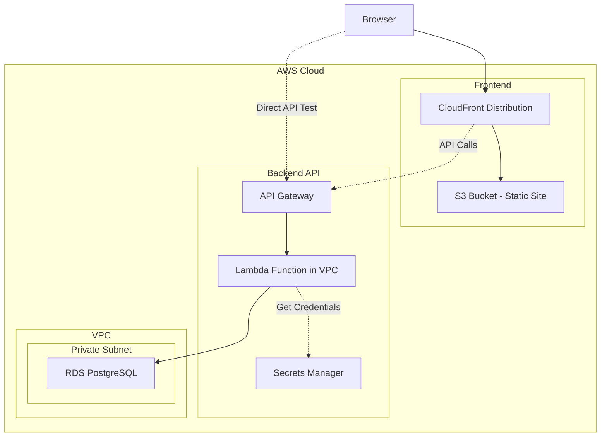

# 実装演習 RDS PostgreSQLとLambdaの連携 (AWS CDK + Lambda + RDS + Next.js)

## 課題

### 要件

1. CRUD操作をサポートするREST API（Lambda + RDS PostgreSQL + API Gateway）
1. AWS CDKによるInfrastructure as Code実装
1. VPC内でのLambda配置とRDS接続
1. Secrets Managerによる接続情報管理
1. 静的にビルドしたNext.jsフロントエンドをS3でホスティング
1. CloudFrontによるコンテンツ配信

### 実装手順

段階的に実装を進めます。各ステップで動作確認を行い、問題があれば次に進む前に解決します。

1. CDKプロジェクトの初期化とRDS環境構築
1. Lambda関数の実装
1. API Gatewayの作成と疎通確認
1. API動作確認とテスト
1. Next.jsフロントエンドの実装
1. S3 + CloudFrontデプロイと動作確認
1. クリーンアップ

## 構成図

### システム全体の構成



クライアント（ブラウザ）は、CloudFront経由で静的サイト（Next.js）にアクセスします。
Next.jsアプリケーションは、API Gateway経由でLambda関数を呼び出し、Lambda関数がVPC内のRDS PostgreSQLとやり取りします。
データベース接続情報はSecrets Managerで安全に管理されます。

## Step 1: CDKプロジェクトの初期化とRDS環境構築

### 前提条件

- Node.js 22以上がインストールされていること
- AWS CLIがインストールされ、認証情報が設定されていること
- AWS CDKがグローバルにインストールされていること

```bash
# Node.jsのバージョン確認
node --version

# AWS CLIの確認
aws --version

# AWS CDKのインストール（未インストールの場合）
npm install -g aws-cdk

# AWS CDKのバージョン確認
cdk --version
```


### プロジェクト構造の作成

```bash
mkdir 07.cdk-lambda-rds
cd 07.cdk-lambda-rds
mkdir -p infrastructure/cdk
mkdir -p backend/lambda
mkdir -p frontend
```

最終的なディレクトリ構成：

```
07.cdk-lambda-rds/
├── README.md
├── infrastructure/
│   └── cdk/
│       ├── bin/
│       │   └── cdk.ts
│       ├── lib/
│       │   └── cdk-stack.ts
│       ├── cdk.json
│       ├── package.json
│       └── tsconfig.json
├── backend/
│   └── lambda/
│       ├── index.mjs
│       └── package.json
└── frontend/
    └── nextjs/
        └── (Next.jsプロジェクト)
```

### CDKプロジェクトの初期化

```bash
cd infrastructure/cdk
cdk init app --language typescript
npm install
```

### スタック名の設定

`infrastructure/cdk/bin/cdk.ts` を編集します。

```typescript
#!/usr/bin/env node
import 'source-map-support/register';
import * as cdk from 'aws-cdk-lib';
import { CdkStack } from '../lib/cdk-stack';

const app = new cdk.App();
new CdkStack(app, 'RdsLambdaStack', {
  stackName: 'RdsLambdaStack', // 衝突しない名前を設定してください
});
```

### CDKスタックの実装（VPC + RDS + Secrets Manager）

`infrastructure/cdk/lib/cdk-stack.ts` を編集します。

```typescript
import * as cdk from 'aws-cdk-lib';
import * as ec2 from 'aws-cdk-lib/aws-ec2';
import * as rds from 'aws-cdk-lib/aws-rds';
import * as secretsmanager from 'aws-cdk-lib/aws-secretsmanager';
import * as lambda from 'aws-cdk-lib/aws-lambda';
import { Construct } from 'constructs';
import * as path from 'path';

export class CdkStack extends cdk.Stack {
  constructor(scope: Construct, id: string, props?: cdk.StackProps) {
    super(scope, id, props);

    // VPCの作成
    const vpc = new ec2.Vpc(this, 'TodoVpc', {
      maxAzs: 2,
      natGateways: 1,
      subnetConfiguration: [
        {
          cidrMask: 24,
          name: 'Public',
          subnetType: ec2.SubnetType.PUBLIC,
        },
        {
          cidrMask: 24,
          name: 'Private',
          subnetType: ec2.SubnetType.PRIVATE_WITH_EGRESS,
        },
        {
          cidrMask: 28,
          name: 'Database',
          subnetType: ec2.SubnetType.PRIVATE_ISOLATED,
        },
      ],
    });

    // RDS用セキュリティグループ
    const dbSecurityGroup = new ec2.SecurityGroup(this, 'DbSecurityGroup', {
      vpc,
      description: 'Security group for RDS instance',
      allowAllOutbound: false,
    });

    // Lambda用セキュリティグループ
    const lambdaSecurityGroup = new ec2.SecurityGroup(this, 'LambdaSecurityGroup', {
      vpc,
      description: 'Security group for Lambda functions',
      allowAllOutbound: true,
    });

    // LambdaからRDSへの接続を許可
    dbSecurityGroup.addIngressRule(
      lambdaSecurityGroup,
      ec2.Port.tcp(5432),
      'Allow Lambda to access RDS'
    );

    // RDS PostgreSQLインスタンスの作成
    const dbInstance = new rds.DatabaseInstance(this, 'TodoDatabase', {
      engine: rds.DatabaseInstanceEngine.postgres({
        version: rds.PostgresEngineVersion.VER_17,
      }),
      instanceType: ec2.InstanceType.of(
        ec2.InstanceClass.T3,
        ec2.InstanceSize.MICRO
      ),
      vpc,
      vpcSubnets: {
        subnetType: ec2.SubnetType.PRIVATE_ISOLATED,
      },
      securityGroups: [dbSecurityGroup],
      databaseName: 'tododb',
      credentials: rds.Credentials.fromGeneratedSecret('postgres', {
        secretName: `${this.stackName}-rds-todo-credentials`,
      }),
      allocatedStorage: 20,
      maxAllocatedStorage: 100,
      backupRetention: cdk.Duration.days(7),
      deleteAutomatedBackups: true,
      removalPolicy: cdk.RemovalPolicy.DESTROY, // 開発環境用：スタック削除時にRDSも削除
      deletionProtection: false,
    });

    // Lambda関数の作成
    const todoFunction = new lambda.Function(this, 'TodoFunction', {
      runtime: lambda.Runtime.NODEJS_22_X,
      handler: 'index.handler',
      code: lambda.Code.fromAsset(path.join(__dirname, '../../../backend/lambda')),
      environment: {
        DB_SECRET_ARN: dbInstance.secret?.secretArn || '',
      },
      timeout: cdk.Duration.seconds(30),
      memorySize: 512,
      vpc,
      vpcSubnets: {
        subnetType: ec2.SubnetType.PRIVATE_WITH_EGRESS,
      },
      securityGroups: [lambdaSecurityGroup],
    });

    // Lambda関数にSecrets Managerへのアクセス権限を付与
    dbInstance.secret?.grantRead(todoFunction);

    // 出力
    new cdk.CfnOutput(this, 'DbEndpoint', {
      value: dbInstance.dbInstanceEndpointAddress,
      description: 'RDS Endpoint'
    });

    new cdk.CfnOutput(this, 'DbSecretArn', {
      value: dbInstance.secret?.secretArn || '',
      description: 'Database Secret ARN'
    });

    new cdk.CfnOutput(this, 'TodoFunctionName', {
      value: todoFunction.functionName,
      description: 'Lambda Function Name'
    });
  }
}
```

### デプロイ

```bash
cd infrastructure/cdk
npm run build
cdk deploy --require-approval never
```

このステップでは以下のリソースが作成されます：
- VPC（パブリック、プライベート、データベースサブネット）
- RDS PostgreSQLインスタンス
- Secrets Manager（データベース接続情報）
- Lambda関数（基本構成のみ、次ステップで実装）
- セキュリティグループ

**注意**: RDSインスタンスの作成には5〜10分程度かかります。

### 動作確認

AWS Management Consoleで以下を確認：
1. CloudFormationスタックが正常に作成されていること
1. RDSインスタンスが`available`状態になっていること
1. Secrets Managerにデータベース認証情報が保存されていること

またはCLIで確認：

```bash
# RDSインスタンスの確認
aws rds describe-db-instances --query 'DBInstances[*].[DBInstanceIdentifier,DBInstanceStatus,Endpoint.Address]'

# Secrets Managerの確認
aws secretsmanager list-secrets
```

出力された`DbSecretArn`、`DbEndpoint`をメモしておきます。

## Step 2: Lambda関数の実装

### package.jsonの作成

`backend/lambda/package.json` を作成します。

```json
{
  "name": "todo-api-lambda-rds",
  "version": "1.0.0",
  "type": "module",
  "dependencies": {
    "@aws-sdk/client-secrets-manager": "^3.0.0",
    "pg": "^8.11.0"
  }
}
```

### Lambda関数の実装

`backend/lambda/index.mjs` を作成します。

```javascript
import { SecretsManagerClient, GetSecretValueCommand } from "@aws-sdk/client-secrets-manager";
import pg from "pg";

const { Pool } = pg;
const secretsManager = new SecretsManagerClient({});

let pool = null;

// Secrets Managerからデータベース接続情報を取得
async function getDbCredentials() {
  const secretArn = process.env.DB_SECRET_ARN;

  try {
    const response = await secretsManager.send(
      new GetSecretValueCommand({ SecretId: secretArn })
    );
    return JSON.parse(response.SecretString);
  } catch (error) {
    console.error("Error fetching secret:", error);
    throw error;
  }
}

// データベース接続プールの初期化
async function getPool() {
  if (pool) {
    return pool;
  }

  const credentials = await getDbCredentials();

  pool = new Pool({
    host: credentials.host,
    port: credentials.port,
    database: credentials.dbname,
    user: credentials.username,
    password: credentials.password,
    max: 5,
    idleTimeoutMillis: 30000,
    connectionTimeoutMillis: 10000,
  });

  // データベーステーブルの初期化
  await initializeDatabase(pool);

  return pool;
}

// テーブルの作成（初回のみ）
async function initializeDatabase(pool) {
  const client = await pool.connect();
  try {
    await client.query(`
      CREATE TABLE IF NOT EXISTS todos (
        id UUID PRIMARY KEY DEFAULT gen_random_uuid(),
        title VARCHAR(255) NOT NULL,
        completed BOOLEAN DEFAULT FALSE,
        due_date DATE,
        created_at TIMESTAMP DEFAULT CURRENT_TIMESTAMP,
        updated_at TIMESTAMP DEFAULT CURRENT_TIMESTAMP
      )
    `);
    console.log("Database initialized successfully");
  } catch (error) {
    console.error("Error initializing database:", error);
    throw error;
  } finally {
    client.release();
  }
}

// JSONレスポンスを返すためのユーティリティ
const json = (statusCode, body = {}) => ({
  statusCode,
  headers: {
    "Content-Type": "application/json",
    "Access-Control-Allow-Origin": "*",
    "Access-Control-Allow-Headers": "Content-Type",
    "Access-Control-Allow-Methods": "GET,POST,PUT,DELETE,OPTIONS"
  },
  body: JSON.stringify(body)
});

// リクエストボディをパースするユーティリティ
const parseBody = (event) => {
  try {
    return event.body ? JSON.parse(event.body) : {};
  } catch {
    return null;
  }
};

// パスの判定
const isTodosRoot = (path) => /^\/todos\/?$/.test(path);
const isTodosById = (path) => /^\/todos\/([^/]+)\/?$/.test(path);
const idFromPath = (path) => path.split("/").filter(Boolean).pop();

// Lambda関数のエントリポイント
export const handler = async (event) => {
  const method = event.requestContext?.http?.method || event.httpMethod;
  const path = event.requestContext?.http?.path || event.rawPath || event.path;

  console.log(`${method} ${path}`);

  // OPTIONSはCORS対応のために常に200を返す
  if (method === "OPTIONS") {
    return json(200, { ok: true });
  }

  const dbPool = await getPool();

  try {
    // 一覧取得
    if (method === "GET" && isTodosRoot(path)) {
      const limit = Math.min(
        Number(event.queryStringParameters?.limit) || 20,
        100
      );
      const offset = Number(event.queryStringParameters?.offset) || 0;

      const result = await dbPool.query(
        'SELECT * FROM todos ORDER BY created_at DESC LIMIT $1 OFFSET $2',
        [limit, offset]
      );

      const countResult = await dbPool.query('SELECT COUNT(*) FROM todos');
      const total = parseInt(countResult.rows[0].count);

      return json(200, {
        items: result.rows.map(row => ({
          id: row.id,
          title: row.title,
          completed: row.completed,
          dueDate: row.due_date,
          createdAt: row.created_at,
          updatedAt: row.updated_at
        })),
        total,
        limit,
        offset
      });
    }

    // ID指定での取得
    if (method === "GET" && isTodosById(path)) {
      const id = idFromPath(path);
      const result = await dbPool.query(
        'SELECT * FROM todos WHERE id = $1',
        [id]
      );

      if (result.rows.length === 0) {
        return json(404, { message: "not found" });
      }

      const row = result.rows[0];
      return json(200, {
        id: row.id,
        title: row.title,
        completed: row.completed,
        dueDate: row.due_date,
        createdAt: row.created_at,
        updatedAt: row.updated_at
      });
    }

    // 新規作成
    if (method === "POST" && isTodosRoot(path)) {
      const body = parseBody(event);
      if (!body) return json(400, { message: "invalid JSON" });

      const { title, dueDate = null } = body;
      if (!title || typeof title !== "string") {
        return json(400, { message: "title is required" });
      }

      const result = await dbPool.query(
        `INSERT INTO todos (title, completed, due_date, created_at, updated_at)
         VALUES ($1, $2, $3, CURRENT_TIMESTAMP, CURRENT_TIMESTAMP)
         RETURNING *`,
        [title, false, dueDate]
      );

      const row = result.rows[0];
      return json(201, {
        id: row.id,
        title: row.title,
        completed: row.completed,
        dueDate: row.due_date,
        createdAt: row.created_at,
        updatedAt: row.updated_at
      });
    }

    // 更新
    if (method === "PUT" && isTodosById(path)) {
      const id = idFromPath(path);
      const body = parseBody(event);
      if (!body) return json(400, { message: "invalid JSON" });

      // 既存のレコードを確認
      const checkResult = await dbPool.query(
        'SELECT * FROM todos WHERE id = $1',
        [id]
      );

      if (checkResult.rows.length === 0) {
        return json(404, { message: "not found" });
      }

      const updates = [];
      const values = [];
      let paramIndex = 1;

      if ("title" in body) {
        updates.push(`title = $${paramIndex++}`);
        values.push(body.title);
      }
      if ("completed" in body) {
        updates.push(`completed = $${paramIndex++}`);
        values.push(body.completed);
      }
      if ("dueDate" in body) {
        updates.push(`due_date = $${paramIndex++}`);
        values.push(body.dueDate);
      }

      if (updates.length === 0) {
        return json(400, { message: "no updatable fields" });
      }

      updates.push(`updated_at = CURRENT_TIMESTAMP`);
      values.push(id);

      const result = await dbPool.query(
        `UPDATE todos SET ${updates.join(", ")} WHERE id = $${paramIndex} RETURNING *`,
        values
      );

      const row = result.rows[0];
      return json(200, {
        id: row.id,
        title: row.title,
        completed: row.completed,
        dueDate: row.due_date,
        createdAt: row.created_at,
        updatedAt: row.updated_at
      });
    }

    // 削除
    if (method === "DELETE" && isTodosById(path)) {
      const id = idFromPath(path);

      const result = await dbPool.query(
        'DELETE FROM todos WHERE id = $1 RETURNING id',
        [id]
      );

      if (result.rows.length === 0) {
        return json(404, { message: "not found" });
      }

      return {
        statusCode: 204,
        headers: {
          "Access-Control-Allow-Origin": "*"
        }
      };
    }

    return json(404, { message: "route not found" });

  } catch (err) {
    console.error("Database error:", err);
    return json(500, { message: err.message || "error" });
  }
};
```

### デプロイ

```bash
cd infrastructure/cdk
npm run build
cdk deploy --require-approval never
```

### 動作確認

Lambda関数を直接テストします。

```bash
# 出力されたLambda関数名を使用
aws lambda invoke \
  --function-name <TodoFunctionName> \
  --payload '{"httpMethod":"GET","path":"/todos","requestContext":{"http":{"method":"GET","path":"/todos"}}}' \
  response.json

cat response.json
```

初回実行時にテーブルが自動作成され、空の配列が返ってくればOKです。

## Step 3: API Gatewayの作成と疎通確認

### CDKスタックにAPI Gatewayを追加

`infrastructure/cdk/lib/cdk-stack.ts` を更新します。

```diff
 import * as cdk from 'aws-cdk-lib';
 import * as ec2 from 'aws-cdk-lib/aws-ec2';
 import * as rds from 'aws-cdk-lib/aws-rds';
 import * as secretsmanager from 'aws-cdk-lib/aws-secretsmanager';
 import * as lambda from 'aws-cdk-lib/aws-lambda';
+import * as apigateway from 'aws-cdk-lib/aws-apigateway';
 import { Construct } from 'constructs';
 import * as path from 'path';

 export class CdkStack extends cdk.Stack {
   constructor(scope: Construct, id: string, props?: cdk.StackProps) {
     super(scope, id, props);

     // ... (既存のVPC、RDS、Lambda のコード)

     // Lambda関数にSecrets Managerへのアクセス権限を付与
     dbInstance.secret?.grantRead(todoFunction);

+    // API Gatewayの作成
+    const api = new apigateway.RestApi(this, 'TodoApi', {
+      description: 'Todo API with Lambda and RDS',
+      defaultCorsPreflightOptions: {
+        allowOrigins: apigateway.Cors.ALL_ORIGINS,
+        allowMethods: apigateway.Cors.ALL_METHODS,
+        allowHeaders: ['Content-Type', 'Authorization']
+      }
+    });
+
+    // Lambda統合の作成
+    const todoIntegration = new apigateway.LambdaIntegration(todoFunction);
+
+    // /todos エンドポイントの作成
+    const todos = api.root.addResource('todos');
+    todos.addMethod('ANY', todoIntegration);
+
+    // /todos/{id} エンドポイントの作成
+    const todoItem = todos.addResource('{id}');
+    todoItem.addMethod('ANY', todoIntegration);

     // 出力
     new cdk.CfnOutput(this, 'DbEndpoint', {
       value: dbInstance.dbInstanceEndpointAddress,
       description: 'RDS Endpoint'
     });

     new cdk.CfnOutput(this, 'DbSecretArn', {
       value: dbInstance.secret?.secretArn || '',
       description: 'Database Secret ARN'
     });

     new cdk.CfnOutput(this, 'TodoFunctionName', {
       value: todoFunction.functionName,
       description: 'Lambda Function Name'
     });
+
+    new cdk.CfnOutput(this, 'ApiEndpoint', {
+      value: api.url,
+      description: 'API Gateway Endpoint'
+    });
   }
 }
```

### デプロイ

```bash
cd infrastructure/cdk
npm run build
cdk deploy --require-approval never
```

### 動作確認

出力された`ApiEndpoint`を使用してテストします。

```bash
# GETリクエスト
curl https://<ApiEndpoint>/todos

# ブラウザでもアクセス可能
```

空の配列またはデータが返ってくればOKです。

## Step 4: API動作確認とテスト

### 一連の操作をテスト

```bash
# 1. TODOを作成
RESPONSE=$(curl -X POST https://<ApiEndpoint>/todos \
  -H "Content-Type: application/json" \
  -d '{"title": "Test Task from RDS", "dueDate": "2025-12-31"}')

echo $RESPONSE

# 2. 作成したTODOのIDを取得（jqがインストールされている場合）
TODO_ID=$(echo $RESPONSE | jq -r '.id')

# 3. ID指定で取得
curl https://<ApiEndpoint>/todos/$TODO_ID

# 4. 一覧取得
curl https://<ApiEndpoint>/todos

# 5. 更新
curl -X PUT https://<ApiEndpoint>/todos/$TODO_ID \
  -H "Content-Type: application/json" \
  -d '{"completed": true}'

# 6. 削除
curl -X DELETE https://<ApiEndpoint>/todos/$TODO_ID

# 7. 削除確認（404が返ってくるはず）
curl https://<ApiEndpoint>/todos/$TODO_ID
```

### ページネーションのテスト

```bash
# 複数のTODOを作成
for i in {1..5}; do
  curl -X POST https://<ApiEndpoint>/todos \
    -H "Content-Type: application/json" \
    -d "{\"title\": \"Task $i\"}"
  sleep 1
done

# 一覧取得（limit指定）
curl "https://<ApiEndpoint>/todos?limit=2"

# 一覧取得（offset指定）
curl "https://<ApiEndpoint>/todos?limit=2&offset=2"
```

すべての操作が正常に動作すればStep 4は完了です。

## Step 5: Next.jsフロントエンドの実装

### Next.jsプロジェクトの作成

```bash
cd frontend
npx create-next-app@latest nextjs --typescript --tailwind --app --no-src-dir --import-alias "@/*"
cd nextjs
```

インタラクティブな質問には以下のように回答します：
- Would you like to use TypeScript? Yes
- Would you like to use ESLint? Yes
- Would you like to use Tailwind CSS? Yes
- Would you like to use `src/` directory? No
- Would you like to use App Router? Yes
- Would you like to customize the default import alias? No

### 静的エクスポートの設定

`frontend/nextjs/next.config.ts` を編集します。

```typescript
import type { NextConfig } from "next";

const nextConfig: NextConfig = {
  output: 'export',
  images: {
    unoptimized: true
  }
};

export default nextConfig;
```

### 環境変数の設定

`frontend/nextjs/.env.local` を作成します。

```bash
NEXT_PUBLIC_API_ENDPOINT=https://YOUR_API_ENDPOINT/todos
```

実際のAPI Gatewayエンドポイントに置き換えてください。

### TODOアプリの実装

`frontend/nextjs/app/page.tsx` を編集します。

```typescript
'use client';

import { useState, useEffect } from 'react';

interface Todo {
  id: string;
  title: string;
  completed: boolean;
  dueDate?: string;
  createdAt: string;
  updatedAt: string;
}

export default function Home() {
  const [todos, setTodos] = useState<Todo[]>([]);
  const [newTodo, setNewTodo] = useState('');
  const [error, setError] = useState('');
  const [loading, setLoading] = useState(false);

  const API_ENDPOINT = process.env.NEXT_PUBLIC_API_ENDPOINT || '';

  useEffect(() => {
    fetchTodos();
  }, []);

  const fetchTodos = async () => {
    try {
      setLoading(true);
      const response = await fetch(API_ENDPOINT);
      if (!response.ok) throw new Error('Failed to fetch todos');
      const data = await response.json();
      setTodos(data.items || []);
      setError('');
    } catch (err) {
      console.error('Error:', err);
      setError('TODOの取得に失敗しました');
    } finally {
      setLoading(false);
    }
  };

  const addTodo = async () => {
    if (!newTodo.trim()) return;

    try {
      const response = await fetch(API_ENDPOINT, {
        method: 'POST',
        headers: {
          'Content-Type': 'application/json'
        },
        body: JSON.stringify({ title: newTodo })
      });

      if (!response.ok) throw new Error('Failed to add todo');

      setNewTodo('');
      fetchTodos();
      setError('');
    } catch (err) {
      console.error('Error:', err);
      setError('TODOの追加に失敗しました');
    }
  };

  const toggleTodo = async (id: string, completed: boolean) => {
    try {
      const response = await fetch(`${API_ENDPOINT}/${id}`, {
        method: 'PUT',
        headers: {
          'Content-Type': 'application/json'
        },
        body: JSON.stringify({ completed })
      });

      if (!response.ok) throw new Error('Failed to update todo');

      fetchTodos();
      setError('');
    } catch (err) {
      console.error('Error:', err);
      setError('TODOの更新に失敗しました');
    }
  };

  const deleteTodo = async (id: string) => {
    try {
      const response = await fetch(`${API_ENDPOINT}/${id}`, {
        method: 'DELETE'
      });

      if (!response.ok) throw new Error('Failed to delete todo');

      fetchTodos();
      setError('');
    } catch (err) {
      console.error('Error:', err);
      setError('TODOの削除に失敗しました');
    }
  };

  return (
    <div className="min-h-screen bg-gray-100 py-8 px-4">
      <div className="max-w-2xl mx-auto">
        <div className="bg-white rounded-lg shadow-md p-6">
          <h1 className="text-3xl font-bold text-gray-800 mb-6">
            TODO App (RDS + Lambda)
          </h1>

          {error && (
            <div className="bg-red-100 border border-red-400 text-red-700 px-4 py-3 rounded mb-4">
              {error}
            </div>
          )}

          <div className="flex gap-2 mb-6">
            <input
              type="text"
              value={newTodo}
              onChange={(e) => setNewTodo(e.target.value)}
              onKeyPress={(e) => e.key === 'Enter' && addTodo()}
              placeholder="新しいタスクを入力..."
              className="flex-1 px-4 py-2 border border-gray-300 rounded-md focus:outline-none focus:ring-2 focus:ring-blue-500"
            />
            <button
              onClick={addTodo}
              className="px-6 py-2 bg-blue-500 text-white rounded-md hover:bg-blue-600 focus:outline-none focus:ring-2 focus:ring-blue-500"
            >
              追加
            </button>
          </div>

          {loading ? (
            <div className="text-center py-4">読み込み中...</div>
          ) : (
            <ul className="space-y-2">
              {todos.map((todo) => (
                <li
                  key={todo.id}
                  className="flex items-center gap-3 p-3 border-b border-gray-200 last:border-b-0"
                >
                  <input
                    type="checkbox"
                    checked={todo.completed}
                    onChange={(e) => toggleTodo(todo.id, e.target.checked)}
                    className="w-5 h-5 cursor-pointer"
                  />
                  <span
                    className={`flex-1 ${
                      todo.completed ? 'line-through text-gray-400' : 'text-gray-700'
                    }`}
                  >
                    {todo.title}
                  </span>
                  <button
                    onClick={() => deleteTodo(todo.id)}
                    className="px-4 py-1 bg-red-500 text-white rounded hover:bg-red-600 focus:outline-none focus:ring-2 focus:ring-red-500"
                  >
                    削除
                  </button>
                </li>
              ))}
            </ul>
          )}

          {!loading && todos.length === 0 && (
            <div className="text-center py-8 text-gray-500">
              タスクがありません
            </div>
          )}
        </div>
      </div>
    </div>
  );
}
```

### ローカルで動作確認

```bash
npm run dev
```

ブラウザで`http://localhost:3000`にアクセスして、APIと連携したTODOアプリが動作することを確認します。

## Step 6: S3 + CloudFrontデプロイと動作確認

### CDKスタックにS3とCloudFrontを追加

`infrastructure/cdk/lib/cdk-stack.ts` を更新します。

```diff
 import * as cdk from 'aws-cdk-lib';
 import * as ec2 from 'aws-cdk-lib/aws-ec2';
 import * as rds from 'aws-cdk-lib/aws-rds';
 import * as secretsmanager from 'aws-cdk-lib/aws-secretsmanager';
 import * as lambda from 'aws-cdk-lib/aws-lambda';
 import * as apigateway from 'aws-cdk-lib/aws-apigateway';
+import * as s3 from 'aws-cdk-lib/aws-s3';
+import * as cloudfront from 'aws-cdk-lib/aws-cloudfront';
+import * as origins from 'aws-cdk-lib/aws-cloudfront-origins';
 import { Construct } from 'constructs';
 import * as path from 'path';

 export class CdkStack extends cdk.Stack {
   constructor(scope: Construct, id: string, props?: cdk.StackProps) {
     super(scope, id, props);

     // ... (既存のVPC、RDS、Lambda、API Gatewayのコード)

+    // フロントエンド用S3バケットの作成
+    const websiteBucket = new s3.Bucket(this, 'WebsiteBucket', {
+      removalPolicy: cdk.RemovalPolicy.DESTROY,
+      autoDeleteObjects: true,
+      publicReadAccess: false,
+      blockPublicAccess: s3.BlockPublicAccess.BLOCK_ALL
+    });
+
+    // CloudFrontディストリビューションの作成
+    const distribution = new cloudfront.Distribution(this, 'WebsiteDistribution', {
+      defaultBehavior: {
+        origin: new origins.S3Origin(websiteBucket),
+        viewerProtocolPolicy: cloudfront.ViewerProtocolPolicy.REDIRECT_TO_HTTPS
+      },
+      defaultRootObject: 'index.html',
+      errorResponses: [
+        {
+          httpStatus: 404,
+          responseHttpStatus: 200,
+          responsePagePath: '/index.html'
+        }
+      ]
+    });

     // 出力
     new cdk.CfnOutput(this, 'DbEndpoint', {
       value: dbInstance.dbInstanceEndpointAddress,
       description: 'RDS Endpoint'
     });

     new cdk.CfnOutput(this, 'DbSecretArn', {
       value: dbInstance.secret?.secretArn || '',
       description: 'Database Secret ARN'
     });

     new cdk.CfnOutput(this, 'TodoFunctionName', {
       value: todoFunction.functionName,
       description: 'Lambda Function Name'
     });

     new cdk.CfnOutput(this, 'ApiEndpoint', {
       value: api.url,
       description: 'API Gateway Endpoint'
     });
+
+    new cdk.CfnOutput(this, 'WebsiteURL', {
+      value: `https://${distribution.distributionDomainName}`,
+      description: 'Website URL'
+    });
+
+    new cdk.CfnOutput(this, 'WebsiteBucketName', {
+      value: websiteBucket.bucketName,
+      description: 'S3 Bucket Name for Website'
+    });
   }
 }
```

### デプロイ

```bash
cd infrastructure/cdk
npm run build
cdk deploy --require-approval never
```

出力された`WebsiteBucketName`と`WebsiteURL`をメモしておきます。

### Next.jsのビルドとアップロード

```bash
cd frontend/nextjs

# 環境変数の確認
cat .env.local

# ビルド
npm run build

# S3にアップロード
aws s3 sync out/ s3://<WebsiteBucketName>/ --delete
```

### CloudFrontのキャッシュをクリア

```bash
# DistributionIdの取得
DISTRIBUTION_ID=$(aws cloudfront list-distributions \
  --query "DistributionList.Items[?Comment==''].Id" \
  --output text)

# キャッシュのクリア
aws cloudfront create-invalidation \
  --distribution-id $DISTRIBUTION_ID \
  --paths "/*"
```

### 動作確認

ブラウザで`WebsiteURL`にアクセスして、TODOアプリが動作することを確認します。

1. 新しいタスクを追加
1. タスクの完了/未完了を切り替え
1. タスクを削除
1. ページをリロードしてデータが永続化されていることを確認

## Step 7: クリーンアップ

### リソースの削除

不要になったリソースを削除します。

```bash
cd infrastructure/cdk
cdk destroy --force
```

このコマンドで以下のリソースが削除されます：
- VPC
- RDS PostgreSQLインスタンス
- Lambda関数
- API Gateway
- Secrets Manager
- S3バケット（フロントエンド）
- CloudFrontディストリビューション

**注意**: RDSインスタンスの削除には5〜10分程度かかります。
